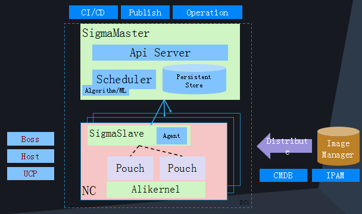
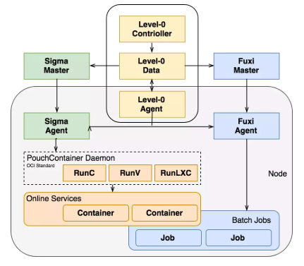

# OM-Assignments
Assignments for the operation and maintenance supervised under Rui Ren.

## Sigma

#### 系统架构

Sigma是阿里巴巴集团开发的一个集群调度和管理系统。它主要由三部分组成：

* Alikernel：这是Sigma系统的最底层，它可以在进行资源分配和时间片分配的时候提供优先级的调度和策略的调整，对任务的时延，任务时间片的抢占、不合理抢占的驱逐都能通过上层的规则配置自行决策。
* SigmaSlave：对于集群中的机器，SigmaSlave负责在单机上进行资源的分配，通过本机的调度对时延敏感任务快速做出决策和响应，避免因全局决策处理时间长带来的业务损失。
* SigmaMaster：在系统的最高层统揽全局，为大量的物理机和上面的容器的部署进行资源调度和算法优化。

#### Sigma和容器的协作

不同于市面上常见的Docker Container，Alibaba的系统架构中运用的容器主要为自研的[Pouch](https://github.com/alibaba/pouch)容器，在服务器集群的每个节点上都同时支持Sigma调度和[Fuxi](https://github.com/alibaba/pouch)调度，可以应对不同的需求和任务敏感度，但是保证了基础环境的统一，这种复杂但高效的调度系统和容器融合的架构被称为“混部架构”。

在Sigma调度时，首先通过SigmaAgent（前述的SigmaSlave的一部分）来启动一个被选中的Pouch容器，启动对应的计算任务，相关的调度和算法决策由Sigma Master完成。略微不同于Fuxi面对的调度需求的实现，Sigma Agent首先通过一个隔离层PouchContainer Daemon来间接对于提供服务操作的Pouch Container的调度。

#### Sigma和Fuxi的区别

Sigma和Fuxi都是阿里巴巴集团自主开发的运维系统，但是它们有着明显的不同：

* Sigma是基于阿里巴巴自主研发的Pouch Container来进行计算任务的分发的，而Fuxi系统则是直接面对线程上的任务分配的；
* Sigma是一个在线实时的资源调度系统，Fuxi则是一个离线的资源调度系统；
* Sigma主要负责电商、交易和搜索相关的事业部门，而Fuxi则负责和计算业务相关的逻辑任务。但是两个调度系统面对的资源和任务在混部架构的组织下，可以实现资源的互相借用，以实现更加弹性的资源扩容和缩容。