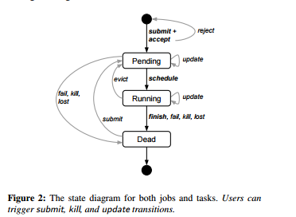
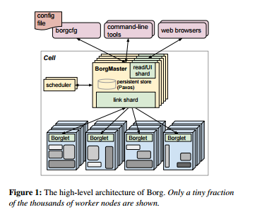

# OM-Assignments
Assignments for the operation and maintenance supervised under Rui Ren.

## Sigma

#### 系统架构

Sigma是阿里巴巴集团开发的一个集群调度和管理系统。它主要由三部分组成：

* Alikernel：这是Sigma系统的最底层，它可以在进行资源分配和时间片分配的时候提供优先级的调度和策略的调整，对任务的时延，任务时间片的抢占、不合理抢占的驱逐都能通过上层的规则配置自行决策。
* SigmaSlave：对于集群中的机器，SigmaSlave负责在单机上进行资源的分配，通过本机的调度对时延敏感任务快速做出决策和响应，避免因全局决策处理时间长带来的业务损失。
* SigmaMaster：在系统的最高层统揽全局，为大量的物理机和上面的容器的部署进行资源调度和算法优化。

#### Sigma和容器的协作

不同于市面上常见的Docker Container，Alibaba的系统架构中运用的容器主要为自研的[Pouch](https://github.com/alibaba/pouch)容器，在服务器集群的每个节点上都同时支持Sigma调度和[Fuxi](https://github.com/alibaba/pouch)调度，可以应对不同的需求和任务敏感度，但是保证了基础环境的统一，这种复杂但高效的调度系统和容器融合的架构被称为“混部架构”。

在Sigma调度时，首先通过SigmaAgent（前述的SigmaSlave的一部分）来启动一个被选中的Pouch容器，启动对应的计算任务，相关的调度和算法决策由Sigma Master完成。略微不同于Fuxi面对的调度需求的实现，Sigma Agent首先通过一个隔离层PouchContainer Daemon来间接对于提供服务操作的Pouch Container的调度。

#### Sigma和Fuxi的区别

Sigma和Fuxi都是阿里巴巴集团自主开发的运维系统，但是它们有着明显的不同：

* Sigma是基于阿里巴巴自主研发的Pouch Container来进行计算任务的分发的，而Fuxi系统则是直接面对线程上的任务分配的；
* Sigma是一个在线实时的资源调度系统，Fuxi则是一个离线的资源调度系统；
* Sigma主要负责电商、交易和搜索相关的事业部门，而Fuxi则负责和计算业务相关的逻辑任务。但是两个调度系统面对的资源和任务在混部架构的组织下，可以实现资源的互相借用，以实现更加弹性的资源扩容和缩容。

## Omega

#### 背景

Google的论文[《Omega flexible, scalable schedulers for large compute clusters》](https://ai.google/research/pubs/pub41684)中把调度分为3代，第一代是独立的集群，第二代是两层调度（mesos,YARN）第三带是共享状态调度。

#### 三类集群管理系统

##### 1. 中央式调度器（Monolithic scheduler）

中央式调度器的特点是，资源的调度和作业的管理功能全部放到一个进程中完成，开源界典型的代表是Hadoop JobTracker的实现。这种设计方式的缺点很明显，扩展性差：首先，集群规模受限，其次，新的调度策略难以融入现有代码中，比如之前仅支持MapReduce作业，现在要支持流式作业，而将流式作业的调度策略嵌入到中央式调度器中是一项很难的工作。

Omega论文中提到了一种对中央式调度器的优化方案：将每种调度策略放到单独一个路径（模块）中，不同的作业由不同的调度策略进行调度。这种方案在作业量和集群规模比较小时，能大大缩短作业相应时间，但由于所有调度策略仍在一个集中式的组件中，整个系统扩展性没有变得更好。

##### 2. 双层调度器（Two-level scheduler）

为了解决中央式调度器的不足，双层调度器是一种很容易想到的解决之道（实际上是分而治之策略或者是策略下放机制）。双层调度器仍保留一个经简化的中央式调度器，但调度策略下放到各个应用程序调度器完成。这种调度器的典型代表是Apache Mesos和Hadoop YARN。Omega论文重点介绍了[Mesos](http://dongxicheng.org/category/apache-mesos/)，[Mesos](http://dongxicheng.org/category/apache-mesos/)是twitter开源的资源管理系统。

[Mesos](http://dongxicheng.org/category/apache-mesos/)资源管理部分由两部分组成：分别是Mesos Master和Mesos Slave，其中，Mesos Slave是每个节点上的代理，负责向Master汇报信息和接收并执行来自Master的命令，而Master则是一个轻量级中央化的资源管理器，负责管理和分配整个集群中的资源。如果一个应用程序想通过Mesos资源管理系统申请和使用资源，需编写两个组件：框架调度器和框架执行器，其中，框架调度器负责从Mesos Master上获取资源、将资源分配给自己内部的各个应用程序，并控制应用程序的执行过程；而框架执行器运行在Mesos Slave中，负责运行该框架中的任务。当前很多框架可以接入Mesos中，包括Hadoop、MPI、Spark等

双层调度器的特点是，各个框架调度器并不知道整个集群资源使用情况，只是被动的接收资源；Mesos Master仅将可用的资源推送给各个框架，而框架自己选择使用还是拒绝这些资源；一旦框架（比如Hadoop JobTracker）接收到新资源后，再进一步将资源分配给其内部的各个应用程序（各个MapReduce作业），进而实现双层调度。

双层调度器的缺点是：

1. 各个框架无法知道整个集群的实时资源使用情况 
2. 采用悲观锁，并发粒度小

##### 3. 共享状态调度器（Shared State Scheduler）

为了克服双层调度器的以上两个缺点，Google开发了下一代资源管理系统Omega,Omega是一种基于共享状态的调度器，该调度器将双层调度器中的集中式资源调度模块简化成了一些持久化的共享数据（状态）和针对这些数据的验证代码，而这里的“共享数据”实际上就是整个集群的实时资源使用信息。一旦引入共享数据后，共享数据的并发访问方式就成为该系统设计的核心，而Omega则采用了传统数据库中基于多版本的并发访问控制方式（也称为“乐观锁”, MVCC, Multi-Version Concurrency Control），这大大提升了Omega的并发性。

由于Omega不再有集中式的调度模块，因此，不能像Mesos或者YARN那样，在一个统一模块中完成以下功能：对整个集群中的所有资源分组，限制每类应用程序的资源使用量，限制每个用户的资源使用量等，这些全部由各个应用程序调度器自我管理和控制，根据论文所述，Omega只是将优先级这一限制放到了共享数据的验证代码中，即当同时由多个应用程序申请同一份资源时，优先级最高的那个应用程序将获得该资源，其他资源限制全部下放到各个子调度器。 

Omega让资源邀约更进一步。在Mesos中，资源邀约是悲观的或独占的。如果资源已经提供给一个应用程序，同样的资源将不能提供给另一个应用程序，直到邀约超时。在Omega中，资源邀约是乐观的。每个应用程序可以请求群集上的所有可用资源，冲突在提交时解决。Omega的资源管理器基本上只是一个记录每个节点状态的关系数据库，使用不同类型的乐观并发控制解决冲突。这样的好处是大大增加了调度器的性能（完全并行）和更好的利用率。

引入多版本并发控制后，限制该机制性能的一个因素是资源访问冲突的次数，冲突次数越多，系统性能下降的越快，而google通过实际负载测试证明，这种方式的冲突次数是完全可以接受的。

#### Omega注意事项

* 服务性作业都较大，对（跨机架的）容错有更严格的配置需求。
* 由于在分配完全群集状态上的开销，Omega大概可以将调度器扩展到十倍，但是无法达到百倍。
* 秒级的调度时间是典型的。他们还比较了十秒级和百秒级的调度，这是两级调度的好处真正发挥作用的地方。无法确定这样的场景有多普遍，也许是由服务性作业来决定？
* 典型的集群利用率约为60％。
* 在OCC实践中，冲突非常罕见。在调度器崩溃之前，他们能够将正常批处理作业上升6倍。
* 增量调度是非常重要的。组调度明显更昂贵，因为要增加冲突处理的实现。显然，大多数的应用程序可以做好增量，通过实现部分资源分配进而达到他们所需的全额资源。
* 即使执行复杂的调度器（每作业十余秒的费），Omega仍然可以在合理的等待时间内调度一个混合的作业。
* 用一个新的MapReduce调度器进行实验，从经验上说，在Omega中会非常容易。

#### 关于Omega一些开放性问题

* 在某些时候，因为高冲突率和重试导致的重复工作，乐观并发控制会崩溃。在实践中好像没有碰到这种问题，但不清楚是否有奇形怪状的任务致使出现最坏的场景。这是受服务和批处理作业联合影响的吗？在实践中有做过什么调优吗？
* 是否缺乏真正可以接受的全局策略？如公平性、抢占等。
* 不同类型的作业调度的时间是多少？有人已经写出非常复杂的调度器吗？

## Apollo

 

---

 

#### Abstract 

有效地调度数据并行计算作业云计算集群对于工作至关重要性能，系统吞吐量和资源利率。随着成长，它变得越来越具有挑战性群集大小和更复杂的工作负载与多样化特点。本文对阿波罗进行了高度评价可扩展和协调的调度框架，其中已部署在Microsoft的生产群集上安排数以百万计的数千次计算任务高效，有效地成千上万机器每天。该框架执行调度决策

以分布式方式，利用全球集群信息通过松散协调的机制。每调度决策考虑未来资源可用性并优化各种性能和系统因素在一个统一的模型中一起。阿波罗很健壮,通过手段应对意想不到的系统动态，并且可以利用空闲的系统资源优雅的同时提供有保证的资源需要。

 

#### Characteristic

 

- **平衡可扩展性与调度质量**：Apollo采用分布式协调调度框架，通过结合同步集群利用率信息，做出独立的调度决策。这样的设计达到了正确的平衡：它避免了由完全分散的架构的独立调度员做出的次优（通常是冲突）决策，同时消除了集中式设计的可扩展性瓶颈和单点故障问题。

- **高质量的调度决策**：Apollo在服务器上安排任务的宗旨是最大限度的减少任务完成时间。Apollo估计模型包含各种因素，并允许调度程序执行加权决策，而不是单纯考虑数据位置或服务器负载。计算的数据并行性使得Apollo能够在作业执行期间从相似任务中得到的运行实时统计数据不断地修正对任务执行时间的估计。

- **为各个调度程序提供集群信息**：Apollo引入了一种轻量级的独立于硬件的机制来通告服务器上的负载。当与每个服务器上的本地任务队列结合使用时，该机制提供了所有服务器上近期的资源可用性视图。调度程序会在决策中使用到该视图。

- **妥善处理异常的运行行为**：Apollo通过一系列动态调整的纠正机制来使自身的鲁棒性得到保证。Apollo提出了一种独特的延迟校正机制，当独立调度程序之间的冲突造成较大影响时这一机制会介入。数据表明这种方法在实践中运行良好。

- **机会调度** ：Apollo引入了机会调度，有效地创建了两类任务：常规任务和机会任务。 Apollo确保常规任务的低延迟，同时使用机会性任务实现高利用率，以满足常规任务留下的冗余。 Apollo进一步使用基于令牌的机制来管理容量，并通过限制常规任务的总数来避免系统过载。

- **减少部署Apollo过程中带来的性能下降**：Apollo支持分阶段部署到生产集群并进行大规模验证。这些限制在研究中很少受到关注，但在实践中从来都不是至关重要的，Apollo开发团队分享了实现这些要求目标的经验。

 
#### Apollo Overview

 

-  A sample SCOPE execution graph

 

 

-  Apollo architectural overview

 

 

上图是Apollo的整体结构图。Job Manager（JM）就是一个调度器，它负责对作业进行调度，每一个集群都会拥有一个Resource Monitor（RM），每一台服务器都拥有一个Process Node（PN），它们两个协调工作来为调度器提供一个全局的视角，供调度器进行调度决策时使用。每个PN负责对本地服务器的资源进行管理，RM会从集群 中每个服务器上的PN那里收集信息，汇总成全局信息后给每个JM。 

 

 

 

#### Evaluations

 

 

 

 

 

 

- 上图显示了Apollo被部署6个月中每小时的峰值调度率，突出显示Apollo可以不断提供超过10,000的调度速率，在单个集群中达到每秒20,000个。这证实了对分布式调度基础设施的需求，因为任何单个调度器都难以以此速率做出高质量的决策。

 

 

 

 

- 实验团队深入研究了两周的时间并重新安装了Apollo。图7（a）显示了集群中并发运行的作业及其任务的数量，而图7（b）显示了同一时间段内的服务器CPU利用率，每10秒采样一次。 Apollo能够运行750个并发的复杂作业（140,000个并行常规任务），并在工作日需求高时实现90％以上的CPU利用率，从而达到集群的容量。图7（c）展示了常规任务和机会任务所分配到的CPU占比。

 

#### Conclusion

 

- 综合测试表明，Apollo能在微软的应用场景下提供出色的工作性能，同时具有高度的可扩展性。但是，Apollo对于运行时间的估计准确度受诸多因素影响，例如对于复杂的用户代码，其资源消耗和执行时间因输入的数据特征而异，在此情况下，Apollo的预测将会变得困难且不准确，尽管研发团队引入了动态调度决策，其调度质量和估计准确度还有待进一步的提升。研发团队也表示将在未来在此方面做进一步的研究与优化。

## Borg
### Abstract

  Google的论文[《Large-scale cluster management at Google with Borg》](https://dl.acm.org/citation.cfm?id=2741964)介绍的Borg系统是一个集群管理工具，在它上面运行着成千上万的job，这些job来自许许多多不同的应用，并且跨越多个集群，而每个集群又由大量的机器构成。

  Borg通过组合准入控制，高效的任务打包，超额负载以及基于进程级别性能隔离的机器共享从而实现高利用率。它支持那些高可用的应用，它们的运行时特性能够最小化错误恢复时间，它们的调度策略降低了相关错误发生的可能性。为了简化用户的使用，Borg提供了一个声明工作规范语言，名称服务一体化机制，实时job监控以及一系列用于分析和模拟系统行为的工具。

### Characteristic

1. 它隐藏了资源管理以及错误处理，因此用户能集中精力开发应用
1. 具有非常高的可靠性和可用性，从而能够支持具有这些特性的应用
1. 能够让我们跨越数以千计的机器有效地运行负载
1. 在这么大规模处理这些问题并且还能达到这样弹性和完整性的系统之一  

### User

* **工作负载** 
  * 长时间运行不能停止的服务并且要求能够处理短暂的，延迟敏感的请求
  * 通常需要几秒到几天来完成的批处理job，这些job对短时间的性能波动并不是非常敏感

  高优先级的job称为prod，剩下的则称为non-prod。多数的长时间运行的服务job是prod类型的，而多数的批处理job是non-prod类型的。在一个具有代表性的cell中，prod类型的job分配了大概所有CPU资源的70%并且代表了60%的CPU使用；在内存方面，prod类型的job分配了大概所有内存资源的55%并且代表了大概85%的内存使用

* **集群和cell**  
  * 一个cell中的机器通常属于单个集群，并且由数据中心规模的高性能网络结构连接起来
  * 一个集群通常存在于单个数据中心里，而多个数据中心的集合构成了一个site

* **job和task**  
  * Borg的一个job的属性通常包括它的名字，所有者以及它拥有的task的名字。一个job的运行可以推迟到上一个结束之后才开始并且一个job只能运行在一个cell中
  * 每个task代表了运行在一个容器或者一个物理机器内的一系列Linux进程

  用户通常通过向Borg发送远程过程调用，即利用一些命令行工具，来操作job或者我们的监视系统。  
  

* **allocation**  
  Borg的alloc操作是指在一台机器上预留一些资源，从而能够在其上运行一个或者多个资源；这些资源不管是否被使用都是保持被分配状态的。Allocs操作可以被用来保留资源用于未来task的使用，也可以用于在停止以及启动一个task之间保存资源，还可以用于将不同job里的task收集起来，让它们运行在同一台机器中

* **优先级，配额以及准入控制**  
  * 每个job都有一个优先级（priority），也就是一个小的正整数。一个高优先级的task可以以牺牲另一个较低优先级的task为代价来获取资源，即使这种牺牲包括抢占或者杀死较低优先级的task
  * 配额表示哪些job能够被调度。可以理解为在给定优先级下的资源请求向量。资源请求是指在一段时间内，一般是一个月内，一个用户的job能请求的最大资源数目
  * 一个用户的job只有在满足了它所在优先级的配额之后才能被准入

* **命名以及监控**  
  * Borg为每个task创造了一个叫BNS类型的名字，这个名字中包含了cell的名字，job的名字以及task的编号。Borg会将task的主机名，端口号以及这个BNS名字写入一个文件中
  * BNS名字同样被用作task的DNS名字基础，因此对于用户ubar拥有的一个在叫做cc的cell中的一个叫jfoo的job中的第五十个task，我们就可以通过域名50.jfoo.ubar.cc.borg.google.com访问到
  * 几乎Borg之下运行的每一个task都有一个内置的HTTP server用于发布task的健康状况以及其他许多的性能指标。Borg会监视健康检查的URL并且会重启那些没有即使回复的task或者直接返回一个HTTP 错误代码

### Structure

  一个Borg的cell由一系列的机器组成，通常在cell运行着一个逻辑的中央控制器叫做Borgmaster，在cell中的每台机器上则运行着一个叫Borglet的代理进程  
  

* **Borgmaster**  
  * 主Borgmaster进程  
  用于处理各种客户的RPC请求，这些请求无非包括状态变更（用于创建job）或者对数据的只读访问（用于查询的job）
  * 分离的调度器  
  当一个job被提交的时候，Borgmaster会将它持续性地记录在Paxos中，并且将该job中的task都加入挂起队列中。这些都是由调度器异步扫描完成的，它会在有足够资源并且符合job的限制条件的时候将task部署到机器上。调度器主要操作的是task，而不是job

* **Borglet**  
  Borglet是一个本地的Borg代理，它会出现在cell中的每一台机器上。它启动，停止task；在task失败的时候重启它们，通过控制操作系统内核设置来管理本地资源以及向Borgmaster和其他监视系统报告机器状态。

  Borgmaster每过几分钟就轮询每个Borglet获取机器的当前状态，同时向它们发送外部的请求。这能够让Borgmaster控制交互的速率，避免了显示的流量控制和恢复风暴。

* **可扩展性**
  * 一个单一的Borgmaster可以管理一个cell中许许多多的机器，而一些cell每分钟要接收超过1000个的task。一个忙碌的Borgmaster会使用10-14个CPU核心以及搞到50G的RAM
  * 为了提高响应时间，我们添加了额外的线程用于和Borglet的交互以及响应只读的RPC。为了提高性能，我们在五个Borgmaster重复单元间共享（部分地）这些功能。上述这些改进让99%的UI相应时间降低到1s以下，而让95%的Borglet轮询间隔降低到10s以下。
  * 评估一台机器的可用性并为它评分是非常昂贵的，因此Borg会缓存它们直到机器或者task的特性发生改变
  * Borg只会对每个Equivalence classes里的一个task做可行性分析以及打分操作，而Equivalence classes其实就是一组具有相同请求的task。
  * 对一个大的cell中的每台机器都进行可行性计算和打分是非常浪费的，因此调度器会对机器进行随机的测试直到找到足够多可行的机器用于打分，然后再在其中挑选出最好的
