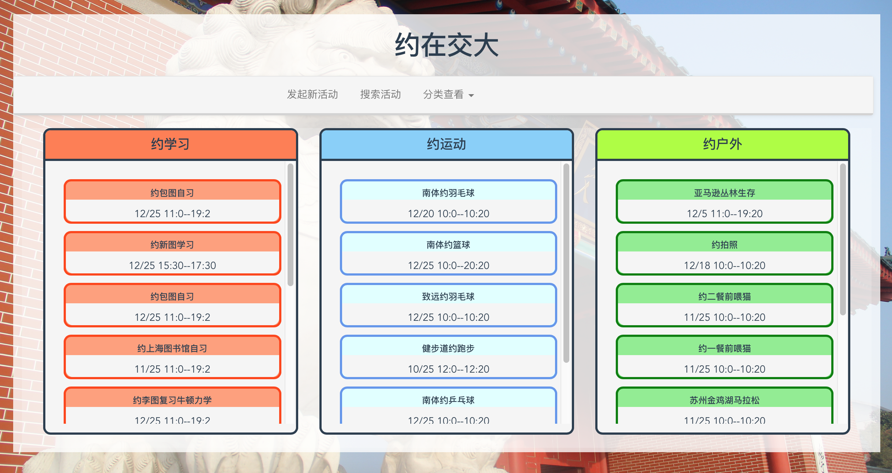
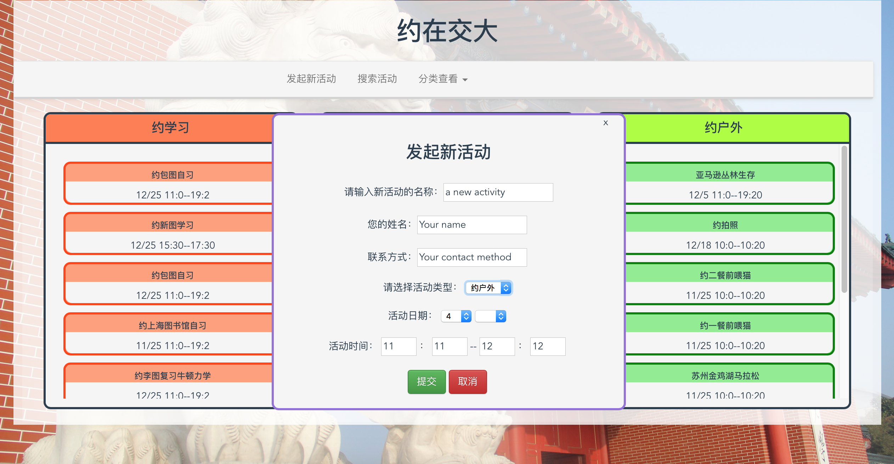
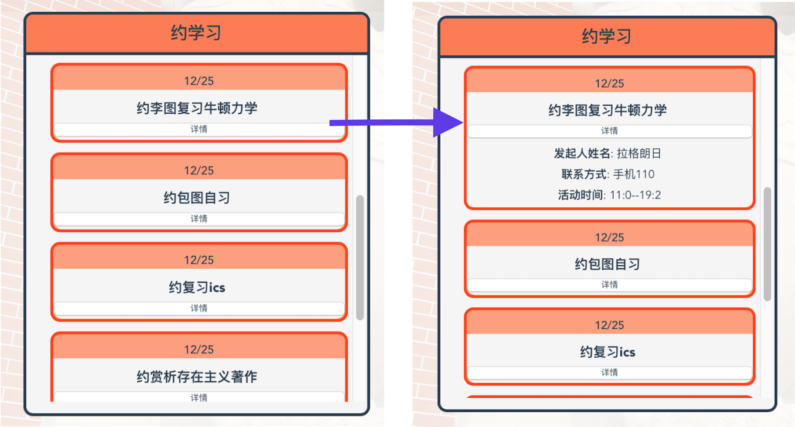
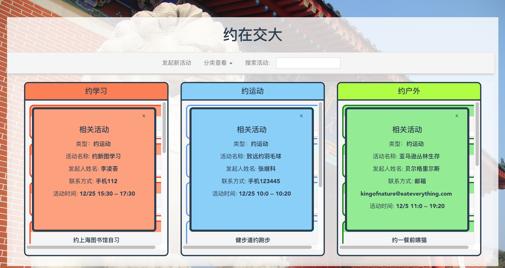
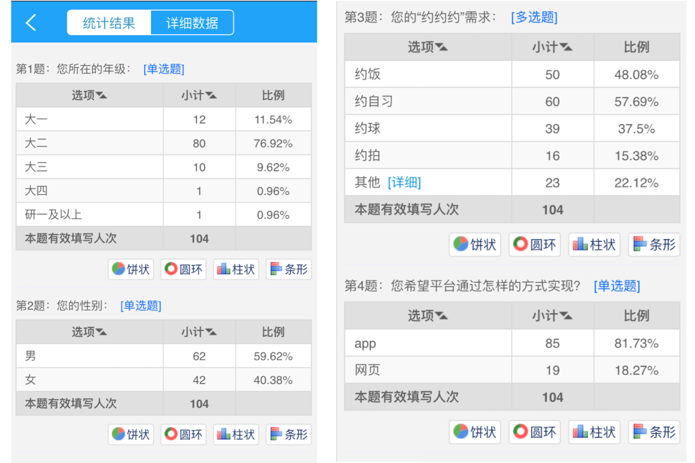

# 约在交大
软件工程作业，目标是制作一个为校内同学提供各种“约”服务的平台，比如“约运动”、“约学习”等。
初步地，我们决定基于vue.js构建这个工程。

## 使用说明
为了在本地运行该工程，需要有的支持有:
* 安装npm
* 安装node.js
* 在项目文件夹中运行npm install安装项目需要的支持文件
* 利用命令npm run dev运行项目文件

Logs of team work:

1. 11-29: 小组成员和任锐老师在软院对小组题目进行讨论；
2. 11-29 -- 12--01: 编写和分发调查问卷，了解项目创意的实际需求
3. 12-01: 工程repo创立
4. 12-07: 小组决定分不同模块进行工作，分为以下四个模块：
* poster展示模块：用以展示当前已有的用户提交的“约”需求
* search模块：用以对于不同要求的poster已经过滤查找
* poster提交模块：用于支持用户新建和提交新的需求
* router模块：在初始化时，展示posterboard，在search之后将符合要求的poster展示出来
5. 12-15: 因为人员原因，对任务分配进行了重新的安排，主要是：
* 李凌荟同学: 负责网页的“搜索栏”模块的构建
* 曹金坤同学: 负责余下工作的开展实施
6. 12-24: 分工再次调整:
* 曹金坤同学: 完成所有的代码工作和README.md编写
* 李凌荟同学: 负责配套的ppt的制作

## 页面部分效果图

#### 主页效果

#### 创建新的活动信息

#### 展示活动详情

#### 搜索相关活动

## 附: 问卷调查数据统计

