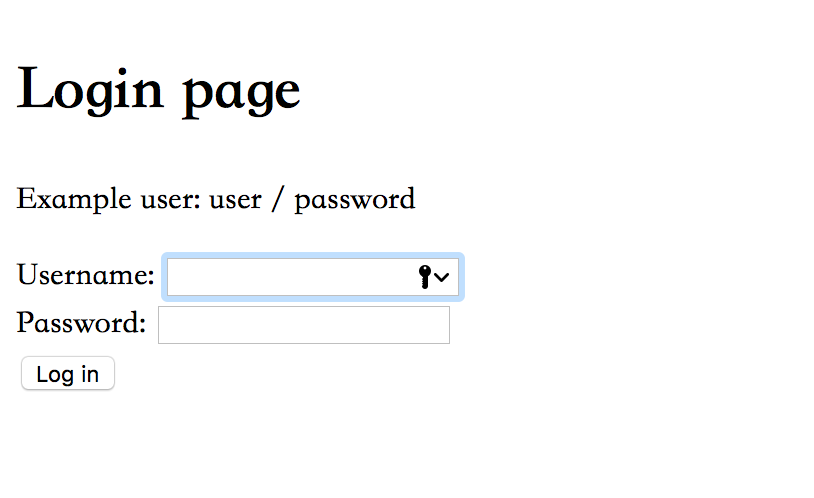
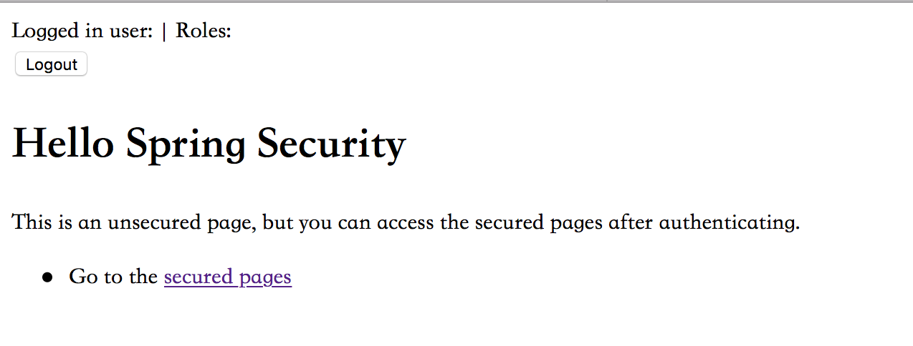

# SJTU_SE_Backend
Assignments of the course SE417 and SE418 of SJTU

Note: the demo dictionary file lies at the path: *src/main/java/dictionary.txt*

* update 27/4/2018	

  Add the **spring security** module for the authentication before generalizing a word ladder. The main logic is that a user must have logged in before he calls a wordladder. 

  *Example*

  1. Without logging in, enter the url in browser to look for a word ladder from *apple* to *keep*: **localhost:8080/main/start=apple&end=keep**. However, causing no authentication, the page will goto the login page:

     

  2. Then after loging in with forehand set account (default, a account is create in file *src/main/java/lessons.backend/config/SecurityConfig* with username = **"user"** and password = **"123"**), page jumps to print the wordladder found:

     

  3. Because already logged in, and account information is recorded in cookies, user can continue find wordladder in url with format: **localhost:8080/main/start=startword&end=endword** with no need to duplication of authentication. And the index page is set at **localhost:8080/index** as:

     