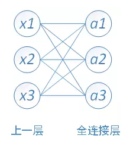
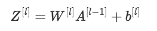
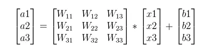
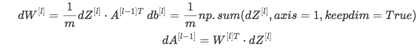
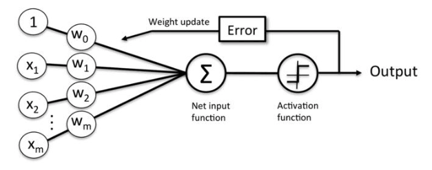
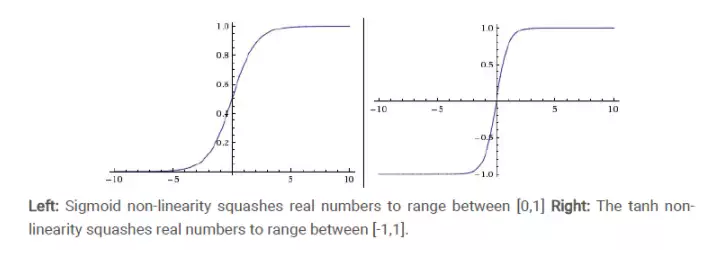
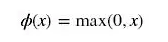
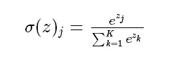
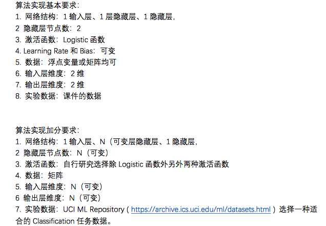
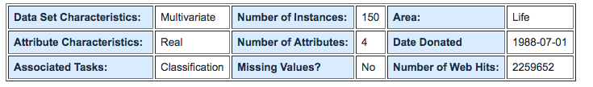

# BPNN大作业的报告

##### 曹金坤 515260910022

## 简述

在本次大作业中，我实现了简单的基于**“可反向传播神经网络”(BPNN)**的模型，这种当下流行的可以胜任高维数据拟合的模型，主要用于回归、分类等问题。在结合具有记忆功能的**递归神经网络-Recurrent Neural Network(RNN)**的基础上，神经网络还常常被用于语音识别、自然语言处理、高维时序数据处理等问题，在结合具有多层级特征采集和拟合能力的**卷积神经网络-Convolutional Neural Network(CNN)**的基础上，辅助以特殊的**上层样／下采样层(Upsampling / Downsampling)**，神经网络模型也常常被用于图像信息处理、视频信息处理等课题。但是，在本次的作业中，实现的模型中只支持基础的**全联接网络-Fully-Connected Neural Network**，主要研究基本的神经网络原理、结构组织、训练细节等。

## 原理

### 全连接层

全连接层是神经网络中的最基本的单层结构。它以一个单维的数据为输入，通过矩阵乘法得到输出。一般的，在全连接层的计算中还要加入**偏置(bias)**以进行输入前后更加灵活的“spcae-shift”。需要说明的是，bias不是必要的，一般来说对于最终结果也不会有太大影响，但是它的加入方便了对于全连接层原理的理解。



#### 前向运算

综上，全连接层的计算过程可以表示如：$\mathcal{F}(x) = W * x + b$。其中，$W$和$b$分别对应于层的权重矩阵和偏置值。



从矩阵运算的角度，也可以把一个全连接层运算过程表示为：



#### 反馈传播

全连接层的反向传播过程较为简单，可以端对端地完成，对应于前述的全连接层前向传播公式，单次的全连接层反向传播公式如下：



### 激活层

在神经网络中，对于全连接层输出的结果，往往需要一个**激活层-Activation Layer**去进行处理，这一步的作用是在网络中引入非线性项，过滤掉经过网络前半部分后得到了较低输出值的激活项。达到网络的对重要关系的选择性拟合、抑制噪声等作用。由此，经过全连接层和激活层的组合，一个较为完整的神经网络的组织可以形象化的被下图表示。在这部分中，我简单介绍几个在大作业中得到了实现的激活函数的表示、原理，为之后的代码实现打下基础。



#### Sigmoid

得益于很早便已经较为成熟的**Logistic回归拟合**，Sigmoid曾经是最为广泛使用的激活函数之一。他的数学形式如下：


#### tanh

**tanh**激活函数是一种曾经比较流行的激活函数，他的形式直接来自于数学中的既有函数，在原点两侧保持对称，带来了一切比较好的几何性质。他的数学表示和曲线图像如下图所示。




#### ReLU

相较于Sigmoid和Tanh激活函数，ReLU是近几年来使用最广泛的激活函数类型。它对于输入的过滤简单粗暴，只有正输出才可以激活它，其余的项目全部被置为基础值（一般是0）。由此，其数学形式表示为：



#### Softmax

Softmax是一种在多分类任务中常常被使用作为网络最后一层激活层的特殊激活函数，它具有把输入项目项目处理后的数值加和归一化到1的特殊属性。



所有激活函数在反向传播过程中的数学表达在此不赘述，因为可以轻易的推导得出。在之后的代码实现中也可以得到相关的过程说明。

## 实现

对于此次大作业的实现，我采用了较为熟悉的**Python**语言，在对于组件的设置和包装上参考了较为熟悉的**Pytorch**框架。经过实现，代码简练地完成了作业的所有要求，即：



#### 项目依赖

为了运行大作业工程文件，需要以下的依赖环境：

* Python 3.x
* Scikit-learn + Numpy函数库 (Scikit-learn库只为了方便数据预处理，不涉及模型构建)

#### 底层实现逻辑

工程中对于所有组件的实现都使用了类Pytorch风格。具体的，所有的激活函数和神经网络层都继承于一个共同的虚母类**Layer**类:

```python
class Layer(object):
    # the ancestor of layer module class
    def __init__(self):
        self.input_cache = None
        self.output_cache = None
        self.grad_cache = None

    def forward(self, data):
        pass

    def backward(self, data, error, lr):
        pass
```

**Layer**中包含了built-in的输入、输出和上一次bp产生的梯度三种缓存信息。*forward*和*backward*函数被定义成虚函数，具体实现在继承它的功能类中完成。基于**Layer**类，全连接层和激活层被实现，在此举出两例：

```python
# --------- LayerModule.py --------
class fc(Layer):
	# implementation of fully-connected layer
    def __init__(self, input_dim, output_dim):
        self.input_dim = input_dim
        self.output_dim = output_dim
        self.W = np.random.randn(self.input_dim, self.output_dim) / np.sqrt(self.input_dim)
        self.b = np.zeros((1, self.output_dim))

    def forward(self, input):
        self.input_cache = input
        self.output_cache = input.dot(self.W) + self.b
        return self.output_cache

    def backward(self, grad, lr):
        dW = np.dot(self.input_cache.T, grad)
        db = np.sum(grad, axis=0)
        bp_grad = np.dot(grad, self.W.T)
        self.grad_cache = bp_grad
        self.W -= lr * dW
        self.b -= lr * db
        return self.grad_cache
```

```python
# --------- LayerModule.py --------
class sigmoid(Layer):
	# implementation of the Sigmoid Activation function
    def _sigmoid(self,x):
        return 1.0/(1+np.exp(-x))

    def forward(self, input):
        self.input_cache = input
        self.output_cache = self._sigmoid(input)
        return self.output_cache

    def backward(self, grad):
        self.grad_cache = grad * (self.output_cache *(1-self.output_cache))
        return self.grad_cache
```

#### 高层逻辑

为了实现作业要求中包括”可变隐藏层“和”N层隐藏层“等额外要求，在对于最终的网络组织上，我采用了模块化的手段。具体的，对于一个具有结构为: fc -> tanh -> fc -> softmax的神经网络，它的定义可以由以下类完成：

```python
# --------- demo.py --------
import LayerModule # file defined all layer classes

def loss_function(prediction, ground_truth):
    return prediction - ground_truth

class NerualNet(object):
    # a simple definition for a multiple-layer network: fc -> tanh -> fc -> softmax
    def __init__(self, input_dim, hidden_dim, out_cls):
        self.fc1 = LayerModule.fc(input_dim, hidden_dim)
        self.tanh = LayerModule.tanh()
        self.fc2 = LayerModule.fc(hidden_dim, out_cls)
        self.Softmax = LayerModule.softmax()

    def forward(self, data):
        x = self.fc1.forward(data)
        x = self.tanh.forward(x)
        x = self.fc2.forward(x)
        prob = self.Softmax.forward(x)
        return prob

    def backward(self, error, lr):
        grad = self.fc2.backward(error, lr)
        grad = self.tanh.backward(grad)
        grad = self.fc1.backward(grad, lr)

    def update(self, data, label, epochs, lr):
        # an uniform interface during the training of model
        ins_num = len(label)
        for epoch in range(epochs):
            output = self.forward(data)
            # here, the simiplest loss function is adopted, which can be easily replaced with 
            # re-definition of loss function
            error = loss_function(output, label)
            self.backward(error, lr)
```

由此，只需要给定这样一个简单的网络基本结构，所有的层节点数目信息、输入输出的尺寸都不需要预先给定，提高了使用中的网络灵活度，满足了作业格外要求中对于灵活的层节点尺寸的要求。距离来说，如果要在[Iris](https://archive.ics.uci.edu/ml/datasets/iris)进行鸢尾花类别预测的classifiction任务，我们希望定义一个输入的自变量尺寸为**M=4**，最后输出的预测类别为**C=3**的网络，中间隐藏层的节点数目为**H=5**，只需要定义:

```python
nn = NerualNet(4,5,3)
```

对于网络训练，也可以利用给定的*update*函数这一个统一的接口完成，而指定不同的训练轮次和学习率，比如：

```python
# train_data and train_label are already had training data and corresponding labels
# by default as as the requirements of this assignment, they are both of 2-dimensional, 
# thus input in the form of 'Batch'
nn.update(train_data, train_label, 50, 0.1)
```

另外，为了实现作业要求中的“可变层数”的要求，文件中定义了一个更加灵活的网络类:

```python
# ------ demo.py --------
class FlexibleNN(object):
    def __init__(self, layer_list):
        self.layers = []
        input_dim = None
        assert isinstance(layer_list[0], list)
        for layer in layer_list:
            if isinstance(layer, list):
                # the definition of fc-layers
                assert len(layer) > 1
                if input_dim == None:
                    # the beginning of network
                    input_dim = layer[0]
                for i in range(len(layer) - 1):
                    output_dim = layer[i+1]
                    self.layers.append(LayerModule.fc(input_dim, output_dim))
                    input_dim = layer[i+1]
            elif layer == 'tanh':
                self.layers.append(LayerModule.tanh())
            elif layer == 'relu':
                self.layers.append(LayerModule.relu())
            elif layer == 'sigmoid':
                self.layers.append(LayerModule.sigmoid())
            else:
                # illegal item in the layer setting 
                assert(0)

        self.softmax = LayerModule.softmax()
        self.layer_num = len(self.layers)
    
    def forward(self, x):
        for layer in self.layers:
            x = layer.forward(x)
        return self.softmax.forward(x)

    def backward(self, grad, lr):
        for i in range(self.layer_num):
            layer_index = self.layer_num - i - 1
            layer = self.layers[layer_index]
            if isinstance(layer, LayerModule.fc):
                grad = layer.backward(grad, lr)
            else:
                # no learning rate is needed for actication layers
                grad = layer.backward(grad)
```

通过**FlexibleNN**类，不同层数和节点数量的网络可以被轻而易举地定义出来，并且支持其中嵌入不同类别的激活函数，比如有如下的实例化操作：

```python
# network 1: fc(4->3) -> tanh -> fc(3->3) -> softmax
nn_1 = FlexibleNN([[4,3], 'tanh', [3,3]])
# network 2: fc(100->50) -> tanh -> fc(50->200->200) -> relu -> fc(200->100->20) -> softmax
nn_2 = FlexibleNN([[100,50], 'tanh', [500, 200, 200], 'relu', [200, 100, 20]])
```

通常来说，因为所有的简单层都已经被封装好了，而且定义了统一的前向和后相传播的函数接口，所以类似于**FlexibleNN**类的定义并不是必要的，这也是为什么Pytorch中的“layer”被当作最高级的封装单位。但是为了满足作业的额外需求，还是定义了这个类，在一些情况下它也的确带来了方便。

需要说明的是，按照作业的要求，工程中的数据输入是按照batch输入的，当数据集比较小的时候（比如Iris数据集），整个训练集都可以看作一个batch进行输入，满足了作业要求中对于输入和输出层维度的要求。另外，所有的运算变量都经过numpy.darray类的封装，作为矩阵形式进行运算，满足了作业的额外要求。

#### 测试

对于工程文件测试，按照作业的要求，我选取了[UCI ML Repository](https://archive.ics.uci.edu/ml/datasets.html)中的[Iris](https://archive.ics.uci.edu/ml/datasets/iris)数据集，这个数据集非常的简单但是经典，他的简要介绍如下：



为了加载对应的数据，在*demo.py*文件中定义了相关的数据提出了预处理程序，在这不赘述了。

因为仅仅为了验证网络基础原理的有效性，考虑到本来Iris数据集的容量已经很小，所以并没有进行数据集的划分，而是在完整的数据集上进行了简单的全覆盖训练。训练代码如下：

```python
def main():
    train_data, train_label = loadfile_iris()
    train_data = preprocessing.scale(train_data)
    #nn = NerualNet(4,3,3)
    nn = FlexibleNN([[4,3], 'tanh', [3,3]])
    nn.update(train_data, train_label, 50, 0.1)
```

经过100个周期的拟合训练，最后的准确度可以达到97%左右，因为Iris数据集较为干净，所以符合我们的期望。

## 总结

综上所述，按照作业的要求，我实现了如下的功能：

* 单独的全连接层的封装
* 多种激活函数的封装实现
* 可以自由选择节点数据的多层网络统一接口的实现
* 可以自由选择网络层数和每层类型的网络统一接口的实现
* 在Iris数据集上的测试

* 输入输出层的维度、矩阵操作等其他作业要求中的项目

#### 进一步工作

比对于Pytorch中的完整实现，这次的作业还有许多可以改进的地方，具体的方面包括：

* 封装除了SGD之外多种网络优化方法称为单独的类，由其内部定义的接口实现网络的迭代优化
* 当前Layer中的cache占用了较多的内存，可以进行优化
* 支持更多样和自定义的权重初始化方法
* 许许多多其他的features