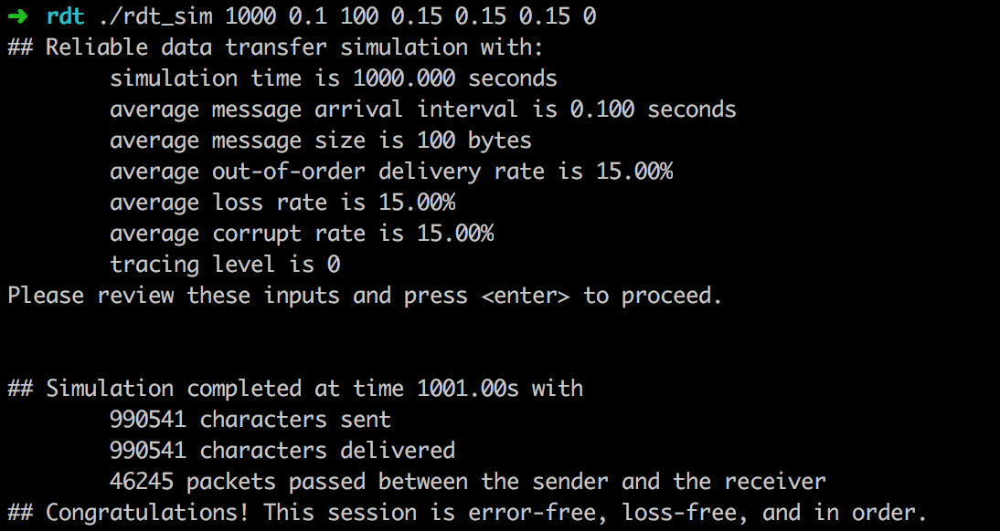
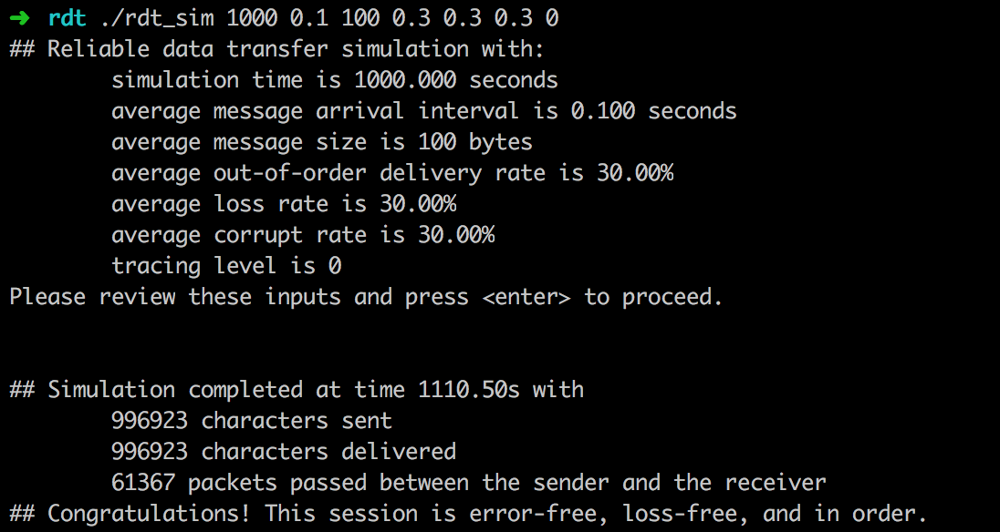

# Lab 1 Document

Name: 曹金坤 

Student ID: 515260910022

Email:  caojinkun@sjtu.edu.cn

---

In this lab, I was assigned to design a RDT protocol for network packet transfer. My implementation is based on GO-BACK-N. Detailed explanations show listed as below.

## 1. Packet Design

There are two design patterns of data packet, respectively for data packet and acknowledge packet.

### data packet

```c
|<-check sum (2byte)->|<-pkt seq_num (4 byte)->|<-payload size (1 byte)->|<-payload->|
```

#### Acknowledge packet

```c
|<-check sum (2byte)->|<-pkt seq_num (4 byte)->|<- nothing ->|
```

Because packets are generated from sent/received message, which could exceed the maximum legth of legal data packet, it's necessary to support the slicing of message into multiple packets. As shown above, checksumming is used in both packet design to verify the correctness of packets. Besides, it's the packet sequential number segment, which is added to ensure the order of packet transfer.

Because no extra information is needed for acknowledgement, acknowledge packet only contains aforementioned two segments. But payload-related segments are necessary in data packet, for which the data packet is designed. The mechanism of packet data or acknowledgement is as usual, we do no repeat here.

### Checksum

We adopt a simple 16-bit checksum implementation as below:

```c
static short checksum(struct packet *pkt){
    unsigned int sum = 0;
    for (int i = 2; i < RDT_PKTSIZE; i++) sum += pkt->data[i];
    while ((sum >> 16) > 0)  sum = (sum >> 16) + (sum & 0xffff);

    return (unsigned short)sum;
}
```

As suggested in assignment document, we set checksum value to be 16-bit. Information loss is unavoidable, but I tries my best to decrease such negative effect.

## 2. Sender implementation

In the sender end, I declare two data structures to organize packet and message in a queue manner respectively, both of which are maintained as pointer. 

When sender receives a message from upper layers. It will firstly add it to the message queue. It the message is legal to be sent, a sliding window mechanism is activated.  It current sliding window is not full, it will allow the a following message in. The message is processed to one or multiple data packets. Otherwise, the message will remain unhandled.

A global variable is maintained to record which segment of current message is being processed. This design bring convenience when time out happens. On the other hand, to recover and continue packet sending from a time out, two maps are also defined to record the current message index and cursor (for slicing message into packets) index.

To the other end, once receiving a legal acknowledge packet, the window would be slided forward to find if there is any packet after the acknowledge position, which is ready to be sent.

## 3. Receiver implementation

Similar as the message on the sender side, there is a packet buffer on the receiver side. And the receiver maintains a global  variable of the sequential number of latest acknowledge packet sent.

Once the receiver gets a packet from lower layers, it will check the value of checksumming segment. Because the checksumming algorithm is uniform on both sides, the checksum value should be same. Then, it checks the packet sequential number, which is expected to equal maintained latest acknowledge number. If both checks pass, the global variables are updated and the acknowledgement packet is sent. If the sequential number of  received packets is not same as expected, then it's disordered and should be put into a buffer at first.

## 4. Time out

Because there is only one timer, we design a time out mechanism for it. The principle is concluded as below:

1. The timer is reset when new data packet is sent.
2. The timer stops only when the sender finds there is no ready packet to be sent after it receives a ack packet.
3. Once the timer reports time out, all packets in current sliding window would be resent.

## 5. Test

As suggested in the assign document, I tested my implementation. The results are shown as below:



