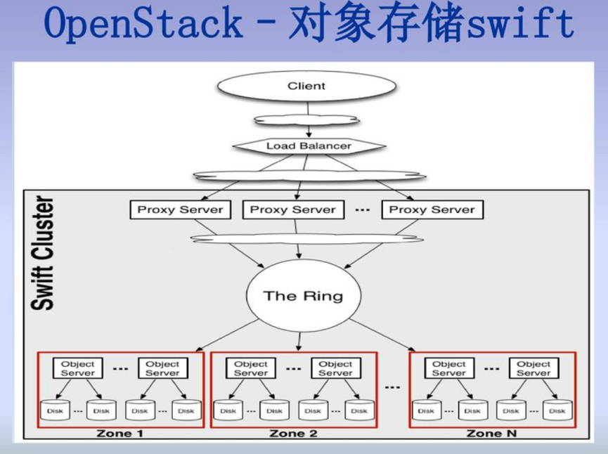
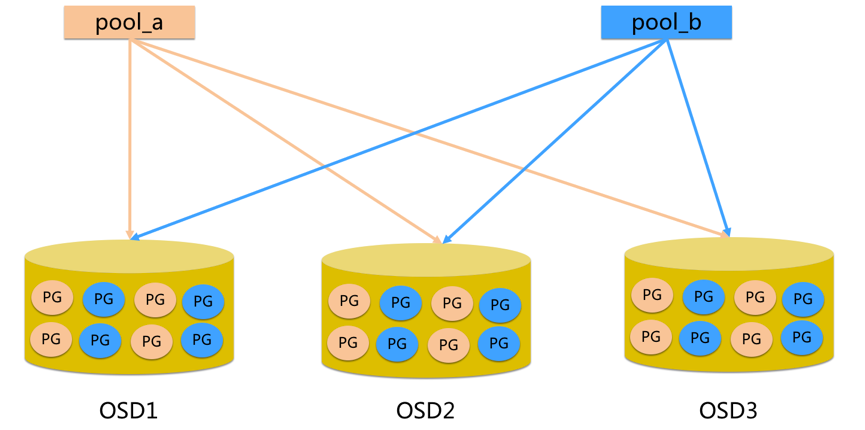
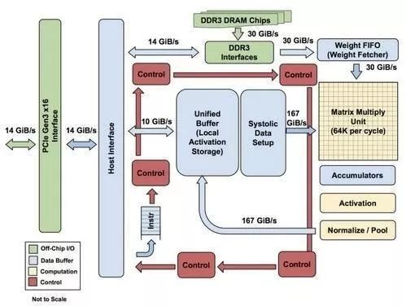
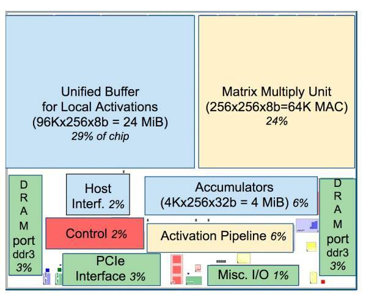

# Hardwares for Internet Platform

## Networks

### IPv4 & IPv6\*

随着世界互联网设备和节点规模的增加，诞生于[1981年](https://tools.ietf.org/html/rfc791)的[IPv4](https://zh.wikipedia.org/wiki/IPv4)(**I**nternet **P**rotocol **v**ersion **4**)]逐渐难以继续满足拓展性的需求,1998年IPv6被正式以[互联网标注规范](https://tools.ietf.org/html/rfc2460)的定义形式出台。相比较传统的IPv4，IPv6有许多显著的优点：

* 地址充足：IPv6产生的初衷主要是针对IPv4地址短缺问题，即从IPv4的32bit地址，扩展到了IPv6的128bit地址，充分解决了地址匮乏问题。同时IPv6地址是有范围的，包括链路本地地址、站点本地地址和任意传播地址，这也进一步增加了地址应用的扩展性。
* 操作简化：通过简化固定的基本报头、采用64比特边界定位、取消IP头的校验和域等措施，以提高网络设备对IP报文的处理效率。
* 扩展为先：引入灵活的扩展报头，按照不同协议要求增加扩展头种类，按照处理顺序合理安排扩展头的顺序，其中网络设备需要处理的扩展头在报文头的前部，而需要宿端处理的扩展头在报文头的尾部。
* 层次区划：IPv6极大的地址空间使层次性的地址规划成为可能，同时国际标准中已经规定了各个类型地址的层次结构，这样既便于路由的快速查找，也有利于路由聚合，缩减IPv6路由表大小，降低网络地址规划的难度。

*\*两者的详细比较内容可见[IPv4 与 IPv6 的比较 (IBM knowledge Center)](https://www.ibm.com/support/knowledgecenter/zh/ssw_ibm_i_72/rzai2/rzai2compipv4ipv6.htm)*

### 交换机(Switch)和路由器(Router)

#### 交换机的性能指标

**交换机**是一种基于MAC地址识别，能完成封装转发数据包功能的网络设备。它可以为接入交换机的任意两个[网络节点](https://baike.baidu.com/item/%E7%BD%91%E7%BB%9C%E8%8A%82%E7%82%B9/9338583)提供独享的电信号通路。最常见的交换机是[以太网交换机](https://baike.baidu.com/item/%E4%BB%A5%E5%A4%AA%E7%BD%91%E4%BA%A4%E6%8D%A2%E6%9C%BA/10186103)。其他常见的还有电话语音交换机、[光纤交换机](https://baike.baidu.com/item/%E5%85%89%E7%BA%A4%E4%BA%A4%E6%8D%A2%E6%9C%BA/8396782)等。它主要的性能指标有：

* 背板带宽（ BackPlane Capacity ）：背板带宽是模块化交换机专有的概念。它是指交换机背板总线的带宽，是由机箱（ Chassis ）所决定的。背板带宽代表了引擎与业务板之间所能传输的最大数据量，单位为 Gbps 。

* 交换容量（ Switch Capability ）：指引擎 / 交换矩阵或转发芯片的交换能力。与背板带宽一样，单位也是 Gbps 。交换容量与背板带宽的区别在于：交换容量是描述的引擎等有源部件，背板带宽描述的是无源部件――背板总线。对于固定配置交换机而言，因为其没有背板总线，固没有背板带宽这一概念。对于模块化交换机，背板带宽由机箱决定，交换矩阵由引擎决定。举个例子， Cisco 6506-E 机箱的背板带宽是 480Gbps ， SUP720 引擎的交换容量是 720Gbps ，所以若 6506-E机箱配备 SUP720 引擎，它的总带宽也只能是 480Gbps 。
* 包转发率（ Throughout ）：指在加载负荷的情况下，设备能成功转发数据的效率。所谓成功转发，仅表示不丢包，不表示不出错。在描述一个设备的包转发率时必须指明是在多大的加载负荷情况下的值，业界一般选用 64byte 的包作为加载负荷。不同厂商对包转发率有不同的称谓，比如转发速率、吞吐率、转发性能、每秒分组数等等。

#### 路由器的性能指标

作为一种网络基础设备，路由器提供[路由](https://zh.wikipedia.org/wiki/%E8%B7%AF%E7%94%B1)与[转送](https://zh.wikipedia.org/w/index.php?title=%E8%BD%89%E9%80%81&action=edit&redlink=1)两种重要机制，可以决定[封包](https://zh.wikipedia.org/wiki/%E5%B0%81%E5%8C%85)从来源端到目的端所经过的路由路径（host到host之间的传输路径），这个过程称为路由；将路由器输入端的封包移送至适当的路由器输出端（在路由器内部进行），这称为转送。路由工作在[OSI模型](https://zh.wikipedia.org/wiki/OSI%E6%A8%A1%E5%9E%8B)的第三层——即[网络层](https://zh.wikipedia.org/wiki/%E7%BD%91%E7%BB%9C%E5%B1%82)，例如[网际协议](https://zh.wikipedia.org/wiki/%E7%BD%91%E9%99%85%E5%8D%8F%E8%AE%AE)（IP）

* 计算能力（Computation Capacity）：路由器的计算能力一般由CPU和ASIC完成，通常在中低端路由器中，CPU负责交换路由信息、路由表查找以及转发数据包。在上述路由器中，CPU的能力直接影响路由器的吞吐量（路由表查找时间）和路由计算能力（影响网络路由收敛时间）。在高端路由器中，通常包转发和查表由ASIC芯片完成，CPU只实现路由协议、计算路由以及分发路由表。由于技术的发展，路由器中许多工作都可以由硬件实现（专用芯片）。CPU性能并不完全反映路由器性能。路由器性能由路由器吞吐量、时延和路由计算能力等指标体现。

* 路由协议支持：

  路由器的路由功能常常基于不同的路由协议:

  * 路由信息协议(RIP):RIP是基于距离向量的路由协议，通常利用跳数来作为计量标准。RIP是一种内部网关协议。由于RIP实现简单，是使用范围最广泛的路由协议。该协议收敛较慢，一般用于规模较小的网络。RIP协议在RFC 1058规定。
  * 路由信息协议版本2 (RIPv2):该协议是RIP的改进版本，允许携带更多的信息，并且与RIP保持兼容。在RIP基础上增加了地址掩码（支持CIDR）、下一跳地址、可选的认证信息等内容。该版本在RFC 1723中规范化。
  * 开放最短路径优先协议版本2 (OSPFv2):该协议是一种基于链路状态的路由协议，由IETF内部网关协议工作组专为IP开发，作为RIP的后继内部网关协议。OSPF的作用在于最小代价路由、多相同路径计算和负载均衡。OSPF拥有开放性和使用SPF算法两大特性。
  * “中间系统－中间系统”协议(ISIS):ISIS协议同样是基于链路状态的路由协议。该协议由ISO提出，起初用于OSI网络环境，后修改成可以在双重环境下运行。该协议与OSPF协议类似，可用于大规模IP网作为内部网关协议。
  * 边缘网关协议(BGP4):BGP协议是用于替代EGP的域间路由协议。BGP4是当前IP网上最流行的也是唯一可选的自治域间路由协议。该版本协议支持CIDR，并且可以使用路由聚合机制大大减小路由表。BGP4协议可以利用多种属性来灵活地控制路由策略。
  * 802.3、802.1Q的支持:802.3是IEEE针对以太网的标准。支持以太网接口的路由器必须符合802.3协议。802.1Q是IEEE对虚拟网的标准。符合802.1Q的路由器接口可以在同一物理接口上支持多个VLAN。
  * 对IPv6的支持和对IP以外协议的支持：除支持IP协议外，路由器设备还可以支持IPX、DECNet、AppleTalk等协议。这些协议在国外有一定应用，在我国应用较少，一般不用考虑。

* 核心性能指标：
  * 全双工线速转发能力：路由器最基本且最重要的功能是数据包转发。在同样端口速率下转发小包是对路由器包转发能力最大的考验。全双工线速转发能力是指以最小包长（以太网64字节、POS口40字节）和最小包间隔（符合协议规定）在路由器端口上双向传输同时不引起丢包。该指标是路由器性能重要指标。
  * 设备吞吐量：指设备整机包转发能力，是设备性能的重要指标。路由器的工作在于根据IP包头或者MPLS标记选路，所以性能指标是转发包数量每秒。设备吞吐量通常小于路由器所有端口吞吐量之和。
  * 端口吞吐量：端口吞吐量是指端口包转发能力，通常使用pps：包每秒来衡量，它是路由器在某端口上的包转发能力。通常采用两个相同速率接口测试。但是测试接口可能与接口位置及关系相关。例如同一插卡上端口间测试的吞吐量可能与不同插卡上端口间吞吐量值不同。
  * 背靠背帧数：背靠背帧数是指以最小帧间隔发送最多数据包不引起丢包时的数据包数量。该指标用于测试路由器缓存能力。有线速全双工转发能力的路由器该指标值无限。
  * 丢包率：丢包率是指测试中所丢失数据包数量占所发送数据包的比率，通常在吞吐量范围内测试。丢包率与数据包长度以及包发送频率相关。在一些环境下可以加上路由抖动、大量路由后测试。

#### 路由器和交换机的比较

路由器和交换机在诸多功能功能上都有互相的覆盖，但是它们在网络平台的基础设施中却仍然是完全不同的独立角色，它们的共同点和不同点总结如下：

* 交换机是一根网线上网，但是大家上网是分别拨号，各自使用自己的宽带，大家上网没有影响。而路由器比交换机多了一个虚拟拨号功能，通过同一台路由器上网的电脑是共用一个宽带账号，大家上网要相互影响。
* 交换机工作在中继层，交换机根据MAC地址寻址。路由器工作在网络层，根据IP地址寻址，路由器可以处理TCP/IP协议，而交换机不可以。
* 路由器提供防火墙的服务，交换机不能提供该功能。集线器、交换机都是做端口扩展的，就是扩大局域网(通常都是以太网)的接入点，也就是能让局域网可以连进来更多的电脑。路由器是用来做网间连接，也就是用来连接不同的网络。
* 交换机可以使连接它的多台电脑组成局域网，如果还有代理服务器的话还可以实现同时上网功能而且局域网所有电脑是共享它的带宽速率的，但是交换机没有路由器的自动识别数据包发送和到达地址的功能。路由器可以自动识别数据包发送和到达的地址，路由器相当于马路上的警察，负责交通疏导和指路的。

### 子网(SubNet)

[IPv4](https://zh.wikipedia.org/wiki/IPv4)地址被分为三部分：网络部分（network）、子网部分（subnetwork，现在常被认为是网络部分的一部分——尽管它本来是“rest”部分的一部分）和主机（host）部分。共有三[类](https://zh.wikipedia.org/wiki/%E5%88%86%E7%B1%BB%E7%BD%91%E7%BB%9C)IP地址，它们分别指定了各部分占多少位。

#### 子网掩码(subnet mask)

是一种用来指明一个[IP地址](https://zh.wikipedia.org/wiki/IP%E5%9C%B0%E5%9D%80)的哪些位标识的是主机所在的网络地址以及哪些位标识的是主机地址的[位掩码](https://zh.wikipedia.org/wiki/%E6%8E%A9%E7%A0%81)。

通常情况下，子网掩码的表示方法和地址本身的表示方法是一样的。在IPv4中，就是点分十进制四组表示法（四个取值从0到255的数字由点隔开，比如255.128.0.0）或表示为一个八位十六进制数（如FF.80.00.00，它等同于255.128.0.0），后者用得较少。

另一种更为简短的形式叫做[无类别域间路由](https://zh.wikipedia.org/wiki/%E6%97%A0%E7%B1%BB%E5%88%AB%E5%9F%9F%E9%97%B4%E8%B7%AF%E7%94%B1)（CIDR）表示法，它给出的是一个地址加上一个斜杠以及网络掩码的二进制表示法中“1”的位数（即网络号中和网络掩码相关的是哪些位）。例如，192.0.2.96/28表示的是一个前28位被用作网络号的IP地址（和255.255.255.240的意思一样）。

子网掩码的好处就是：不管网络有没有划分子网，只要把子网掩码和IP地址进行逐位的“与”运算（AND）即得出网络地址来。这样在路由器处理到来的分组时就可以采用同样的方法。[[1\]](https://zh.wikipedia.org/wiki/%E5%AD%90%E7%BD%91#cite_note-1)

### DNS服务器 (DNS Server)

#### 技术介绍

DNS（Domain Name Server，域名服务器）是进行域名(domain name)和与之相对应的IP地址 (IP address)转换的服务器。DNS中保存了一张域名(domain name)和与之相对应的IP地址 (IP address)的表，以解析消息的域名。 域名是Internet上某一台计算机或计算机组的名称，用于在数据传输时标识计算机的电子方位（有时也指地理位置）。

DNS服务器和DNS Client配合工作，对于域名和对应的IP地址信息进行查询和传递，其中运用到的技术有：

* 查询模式：
  * 递归查询模式（Recursive Query）：一般发生于client向DNS server提交域名解析请求后，SERVER首先查询本身有没有对应的记录，如果有就返回查询的结果，否则代替client向其他的DNS Server发送域名解析请求，并且返回结果；
  * 迭代查询模式（Interative Query）：DNS Server会向Client发送可以进行类似解析工作的其他DNS Server的地址，而不直接回复结果，Client可以再次向其他的DNS Server发送解析请求。
* 域名解析技术：
  * 静态域名解析：Internet上的域名解析一般是静态的，即一个域名所对应的IP地址是静态的，长期不变的。也就是说，如果要在Internet上搭建一个网站，需要有一个固定的IP地址。 
  * 动态域名解析：动态[域名解析](https://baike.baidu.com/item/%E5%9F%9F%E5%90%8D%E8%A7%A3%E6%9E%90)服务，是将用户的[动态IP地址](https://baike.baidu.com/item/%E5%8A%A8%E6%80%81IP%E5%9C%B0%E5%9D%80)映射到一个固定的域名解析服务上，用户每次连接网络的时候，客户端程序就会通过信息传递把该[主机](https://baike.baidu.com/item/%E4%B8%BB%E6%9C%BA/455151)的动态IP地址传送给位于服务商主机上的服务器程序，服务程序负责提供DNS服务并实现动态域名解析。就是说DDNS捕获用户每次变化的IP地址，然后将其与域名相对应，这样域名就可以始终解析到非固定IP的服务器上，互联网用户通过本地的[域名服务器](https://baike.baidu.com/item/%E5%9F%9F%E5%90%8D%E6%9C%8D%E5%8A%A1%E5%99%A8/9705133)获得网站域名的IP地址，从而可以访问网站的服务。

#### DNS服务的优化

在DNS服务的实现中，存在着许多的优化技术，也带来了相应的tradeoff：

* Cache的使用：对于许多域名，一台DNS server都会在短时间内接收到重复的解析请求，这个时候如果还去进行一层层的域名解析，会带来许多不必要的时间负担，所以许多的低层DNS解析节点上也都会保存有一些cache，在接收到对应得以域名解析请求的时候可以进行快速的结果返回；

* 对根服务器的依赖：公用的DNS服务器往往可以追根溯源到十多台“根服务器”上，它们一般负责顶级域名字段的解析，之后分发次级域名的解析给下层的DNS server，这种操作形成了一个树形的结构，但是类似于Cache等技术可以在解析域名的过程中减少对于根服务器的依赖；

  

* 私有DNS Server：因为本质上DNS Server的工作可以通过一个字典文件来替代，所以建立一个DNS Server并不是一个特别复杂的工作。因此，也有所谓的私有DNS Server的存在，而另一方面，诱导他人的设备将这些DNS Server作为选中的DNS服务器也会给他人的网络访问带来风险，或者允许"DNS Pollution"攻击的存在。

### 总结

可以说，寻求更快、并发更高、可拓展性的网络方案是一个持续的话题。一般来说，在路由器、交换机等设备上采用更高的性能标准并不会带来技术上的明显副作用，所以tradeoff往往只存在于考虑到具体预算和设计兼容性的时候。但是对于网络环境的构建，往往需要定制化的工作，特别是对于很常见的内网外网隔离的需求或者对于proxy转发等需求。

另一方面，在互联网环境中，特别是IPv4中，IP地址是一个很稀缺的资源，这个时候还可以通过内网的地址拓展来满足自己系统内的对于“独立”IP地址的需求，此时整个内网环境成为了一个整理，暴露给外界的IP地址尽管很少，但是自己内部的虚拟地址却可以得到扩充，这种方法几乎被所有机构和组织的网络管理策略所采用。
## Storage - Ceph

### 1. Ceph架构简介及使用场景介绍

##### 1.1 Ceph简介
Ceph是一个统一的分布式存储系统，设计初衷是提供较好的性能、可靠性和可扩展性。

Ceph项目最早起源于Sage就读博士期间的工作（最早的成果于2004年发表），并随后贡献给开源社区。在经过了数年的发展之后，目前已得到众多云计算厂商的支持并被广泛应用。RedHat及OpenStack都可与Ceph整合以支持虚拟机镜像的后端存储。

##### 1.2 Ceph特点

- 高性能
	- 摒弃了传统的集中式存储元数据寻址的方案，采用CRUSH算法，数据分布均衡，并行度高。
	- 考虑了容灾域的隔离，能够实现各类负载的副本放置规则，例如跨机房、机架感知等。
	- 能够支持上千个存储节点的规模，支持TB到PB级的数据。
- 高可用性
	- 副本数可以灵活控制。
	- 支持故障域分隔，数据强一致性。
	- 多种故障场景自动进行修复自愈。
	- 没有单点故障，自动管理。
- 高可扩展性
	- 去中心化。
	- 扩展灵活。
	- 随着节点增加而线性增长。
- 特性丰富
	- 支持三种存储接口：块存储、文件存储、对象存储。
	- 支持自定义接口，支持多种语言驱动。

##### 1.3 Ceph架构

支持三种接口：

- Object：有原生的API，而且也兼容Swift和S3的API。
- Block：支持精简配置、快照、克隆。
- File：Posix接口，支持快照。

##### 1.4 Ceph核心组件及概念介绍

- Monitor，一个Ceph集群需要多个Monitor组成的小集群，它们通过Paxos同步数据，用来保存OSD的元数据。
- OSD， OSD全称Object Storage Device，也就是负责响应客户端请求返回具体数据的进程。一个Ceph集群一般都有很多个OSD。
- MDS，MDS全称Ceph Metadata Server，是CephFS服务依赖的元数据服务。
- Object，Ceph最底层的存储单元是Object对象，每个Object包含元数据和原始数据。
- PG，PG全称Placement Grouops，是一个逻辑的概念，一个PG包含多个OSD。引入PG这一层其实是为了更好的分配数据和定位数据。
- RADOS，RADOS全称Reliable Autonomic Distributed Object Store，是Ceph集群的精华，用户实现数据分配、Failover等集群操作。
- Libradio，Librados是Rados提供库，因为RADOS是协议很难直接访问，因此上层的RBD、RGW和CephFS都是通过librados访问的，目前提供PHP、Ruby、Java、Python、C和C++支持。
- CRUSH，CRUSH是Ceph使用的数据分布算法，类似一致性哈希，让数据分配到预期的地方。
- RBD，RBD全称RADOS block device，是Ceph对外提供的块设备服务。
- RGW，RGW全称RADOS gateway，是Ceph对外提供的对象存储服务，接口与S3和Swift兼容。
- CephFS，CephFS全称Ceph File System，是Ceph对外提供的文件系统服务。

##### 1.5 三种存储类型-块存储

典型设备： 磁盘阵列，硬盘

主要是将裸磁盘空间映射给主机使用的。

优点：

- 通过Raid与LVM等手段，对数据提供了保护。
- 多块廉价的硬盘组合起来，提高容量。
- 多块磁盘组合出来的逻辑盘，提升读写效率。

缺点：

- 采用SAN架构组网时，光纤交换机，造价成本高。
- 主机之间无法共享数据。

使用场景：

- docker容器、虚拟机磁盘存储分配。
- 日志存储。
- 文件存储。
- …

##### 1.6 三种存储类型-文件存储

典型设备： FTP、NFS服务器。为了克服块存储文件无法共享的问题，所以有了文件存储。
在服务器上架设FTP与NFS服务，就是文件存储。

优点：

- 造价低，随便一台机器就可以了。
- 方便文件共享。

缺点：

- 读写速率低。
- 传输速率慢。

使用场景：

- 日志存储。
- 有目录结构的文件存储。
- …

##### 1.7 三种存储类型-对象存储

典型设备： 内置大容量硬盘的分布式服务器(swift, s3)

多台服务器内置大容量硬盘，安装上对象存储管理软件，对外提供读写访问功能。

优点：

- 具备块存储的读写高速。
- 具备文件存储的共享等特性。

使用场景： (适合更新变动较少的数据)

- 图片存储。
- 视频存储。
- …
	
### 2. Ceph IO流程及数据分布

##### 2.1 正常IO流程图

步骤：

1. client 创建cluster handler。
2. client 读取配置文件。
3. client 连接上monitor，获取集群map信息。
4. client 读写io 根据crshmap 算法请求对应的主osd数据节点。
5. 主osd数据节点同时写入另外两个副本节点数据。
6. 等待主节点以及另外两个副本节点写完数据状态。
7. 主节点及副本节点写入状态都成功后，返回给client，io写入完成。

##### 2.2 新主IO流程图

说明：
如果新加入的OSD1取代了原有的 OSD4成为 Primary OSD, 由于 OSD1 上未创建 PG , 不存在数据，那么 PG 上的 I/O 无法进行，怎样工作的呢？

步骤：

1. client连接monitor获取集群map信息。
2. 同时新主osd1由于没有pg数据会主动上报monitor告知让osd2临时接替为主。
3. 临时主osd2会把数据全量同步给新主osd1。
4. client IO读写直接连接临时主osd2进行读写。
5. osd2收到读写io，同时写入另外两副本节点。
6. 等待osd2以及另外两副本写入成功。
7. osd2三份数据都写入成功返回给client, 此时client io读写完毕。
8. 如果osd1数据同步完毕，临时主osd2会交出主角色。
9. osd1成为主节点，osd2变成副本。

##### 2.3 Ceph IO算法流程

- File用户需要读写的文件。File->Object映射：
	1. ino (File的元数据，File的唯一id)。
	2. ono(File切分产生的某个object的序号，默认以4M切分一个块大小)。
	3. oid(object id: ino + ono)。
- Object是RADOS需要的对象。Ceph指定一个静态hash函数计算oid的值，将oid映射成一个近似均匀分布的伪随机值，然后和mask按位相与，得到pgid。Object->PG映射：
	1. hash(oid) & mask-> pgid 。
	2. mask = PG总数m(m为2的整数幂)-1 。
- PG(Placement Group),用途是对object的存储进行组织和位置映射, (类似于redis cluster里面的slot的概念) 一个PG里面会有很多object。采用CRUSH算法，将pgid代入其中，然后得到一组OSD。PG->OSD映射：
	1. CRUSH(pgid)->(osd1,osd2,osd3) 。

##### 2.4 Ceph RBD IO流程

步骤：

1. 客户端创建一个pool，需要为这个pool指定pg的数量。
- 创建pool/image rbd设备进行挂载。
- 用户写入的数据进行切块，每个块的大小默认为4M，并且每个块都有一个名字，名字就是object+序号。
- 将每个object通过pg进行副本位置的分配。
- pg根据cursh算法会寻找3个osd，把这个object分别保存在这三个osd上。
- osd上实际是把底层的disk进行了格式化操作，一般部署工具会将它格式化为xfs文件系统。
- object的存储就变成了存储一个文rbd0.object1.file。

##### 2.5 Ceph RBD IO框架图

客户端写数据osd过程：

1. 采用的是librbd的形式，使用librbd创建一个块设备，向这个块设备中写入数据。
- 在客户端本地同过调用librados接口，然后经过pool，rbd，object、pg进行层层映射,在PG这一层中，可以知道数据保存在哪3个OSD上，这3个OSD分为主从的关系。
- 客户端与primay OSD建立SOCKET 通信，将要写入的数据传给primary OSD，由primary OSD再将数据发送给其他replica OSD数据节点。

##### 2.6 Ceph Pool和PG分布情况

说明：

- pool是ceph存储数据时的逻辑分区，它起到namespace的作用。
- 每个pool包含一定数量(可配置)的PG。
- PG里的对象被映射到不同的Object上。
- pool是分布到整个集群的。
- pool可以做故障隔离域，根据不同的用户场景不一进行隔离。

##### 2.7 Ceph 数据扩容PG分布

场景数据迁移流程：

- 现状3个OSD, 4个PG
- 扩容到4个OSD, 4个PG

现状：

扩容后：

说明:
每个OSD上分布很多PG, 并且每个PG会自动散落在不同的OSD上。如果扩容那么相应的PG会进行迁移到新的OSD上，保证PG数量的均衡。

### 3. Ceph心跳机制

##### 3.1 心跳介绍

心跳是用于节点间检测对方是否故障的，以便及时发现故障节点进入相应的故障处理流程。

问题：

- 故障检测时间和心跳报文带来的负载之间做权衡。
- 心跳频率太高则过多的心跳报文会影响系统性能。
- 心跳频率过低则会延长发现故障节点的时间，从而影响系统的可用性。

故障检测策略应该能够做到：

- 及时：节点发生异常如宕机或网络中断时，集群可以在可接受的时间范围内感知。
- 适当的压力：包括对节点的压力，和对网络的压力。
- 容忍网络抖动：网络偶尔延迟。
- 扩散机制：节点存活状态改变导致的元信息变化需要通过某种机制扩散到整个集群。

##### 3.2 Ceph 心跳检测

OSD节点会监听public、cluster、front和back四个端口

- public端口：监听来自Monitor和Client的连接。
- cluster端口：监听来自OSD Peer的连接。
- front端口：供客户端连接集群使用的网卡, 这里临时给集群内部之间进行心跳。
- back端口：供客集群内部使用的网卡。集群内部之间进行心跳。
- hbclient：发送ping心跳的messenger。

##### 3.3 Ceph OSD之间相互心跳检测

步骤：

- 同一个PG内OSD互相心跳，他们互相发送PING/PONG信息。
- 每隔6s检测一次(实际会在这个基础上加一个随机时间来避免峰值)。
- 20s没有检测到心跳回复，加入failure队列。

##### 3.4 Ceph OSD与Mon心跳检测

OSD报告给Monitor：

- OSD有事件发生时（比如故障、PG变更）。
- 自身启动5秒内。
- OSD周期性的上报给Monito
	- OSD检查failure_queue中的伙伴OSD失败信息。
	- 向Monitor发送失效报告，并将失败信息加入failure_pending队列，然后将其从failure_queue移除。
	- 收到来自failure_queue或者failure_pending中的OSD的心跳时，将其从两个队列中移除，并告知Monitor取消之前的失效报告。
	- 当发生与Monitor网络重连时，会将failure_pending中的错误报告加回到failure_queue中，并再次发送给Monitor。
- Monitor统计下线OSD
	- Monitor收集来自OSD的伙伴失效报告。
	- 当错误报告指向的OSD失效超过一定阈值，且有足够多的OSD报告其失效时，将该OSD下线。

##### 3.5 Ceph心跳检测总结

Ceph通过伙伴OSD汇报失效节点和Monitor统计来自OSD的心跳两种方式判定OSD节点失效。

- 及时：伙伴OSD可以在秒级发现节点失效并汇报Monitor，并在几分钟内由Monitor将失效OSD下线。
- 适当的压力：由于有伙伴OSD汇报机制，Monitor与OSD之间的心跳统计更像是一种保险措施，因此OSD向Monitor发送心跳的间隔可以长达600秒，Monitor的检测阈值也可以长达900秒。Ceph实际上是将故障检测过程中中心节点的压力分散到所有的OSD上，以此提高中心节点Monitor的可靠性，进而提高整个集群的可扩展性。
- 容忍网络抖动：Monitor收到OSD对其伙伴OSD的汇报后，并没有马上将目标OSD下线，而是周期性的等待几个条件：
  - 目标OSD的失效时间大于通过固定量osd_heartbeat_grace和历史网络条件动态确定的阈值。
  - 来自不同主机的汇报达到mon_osd_min_down_reporters。
  - 满足前两个条件前失效汇报没有被源OSD取消。
- 扩散：作为中心节点的Monitor并没有在更新OSDMap后尝试广播通知所有的OSD和Client，而是惰性的等待OSD和Client来获取。以此来减少Monitor压力并简化交互逻辑。

## Memory

内存是计算机中重要的部件之一，它是与CPU进行沟通的桥梁。计算机中所有程序的运行都是在内存中进行的，因此内存的性能对计算机的影响非常大。内存(Memory)也被称为内存储器，其作用是用于暂时存放CPU中的运算数据，以及与硬盘等外部存储器交换的数据。只要计算机在运行中，CPU就会把需要运算的数据调到内存中进行运算，当运算完成后CPU再将结果传送出来，内存的运行也决定了计算机的稳定运行。

### 供应商

- 韩国三星电子（Samsung Electronics KSE）
- 美国美光科技（Micron Technology Inc.）
- 海力士半导体（Hynix Semiconductor Inc.）
- 日本尔必达（Elpida Memory Inc.）
- 台湾华邦电子（Winbond）
- 南亚科技（Nanya Technology Corp.）
- 力晶科技（Powerchip Technology Corp.）
- 茂德科技（ProMOS Technologies Inc.）

### 分类

- 只读存储器（ROM）

只读内存（Read-Only Memory）是一种**只能读取资料**的内存。其资料内容在写入后就不能更改，即使断电，这些数据也不会丢失。因而常用于存储各种**固定程序和数据**。

- 随机存储器（RAM）

随机存取存储器（random access memory，RAM）是与CPU直接交换数据的内部存储器，也叫主存(内存)。它可以随时读写，而且速度很快，通常作为操作系统或其他正在运行中的程序的**临时数据存储**媒介。这种存储器在**断电时将丢失**其存储内容，故主要用于存储短时间使用的程序。 按照存储单元的工作原理，随机存储器又分为静态随机存储器（SRAM)和动态随机存储器（DRAM)。

- 高速缓冲存储器（Cache）

高速缓冲存储器（Cache）是存在于主存与CPU之间的一级存储器， 由静态存储芯片(SRAM)组成，容量比较小但速度比主存高得多， 接近于CPU的速度。在计算机存储系统的层次结构中，是介于中央处理器和主存储器之间的**高速小容量**存储器。

### 技术

- SDRAM

  Synchronous Dynamic Random Access Memory，同步动态随机存储器，同步是指内存工作需要同步时钟，内部的命令的发送与数据的传输都以它为基准；动态是指存储阵列需要不断的刷新来保证数据不丢失；随机是指数据不是线性依次存储，而是自由指定地址进行数据读写。SDRAM相较于SRAM造价较低，重量较大，但是速度较慢，曾经是市场的主流，现在已被淘汰。

- DDR

  DDR=Double Data Rate双倍速率,DDR SDRAM=双倍速率同步动态随机存储器，人们习惯称为DDR，其中，SDRAM 是Synchronous Dynamic Random Access Memory的缩写，即同步动态随机存取存储器。而DDR SDRAM是Double Data Rate SDRAM的缩写，是双倍速率同步动态随机存储器的意思。DDR内存是在SDRAM内存基础上发展而来的，仍然沿用SDRAM生产体系，因此对于内存厂商而言，只需对制造普通SDRAM的设备稍加改进，即可实现DDR内存的生产，可有效的降低成本。

  - DDR2

  DDR2和DDR一样，都采用了在时钟的上升延和下降延同时进行数据传输的基本方式，但DDR2采用了采用FBGA芯片封装形式，拥有更好的电气性能与散热性，因此拥有两倍于DDR的预读取系统命令数据的能力。 DDR2内存采用1.8V电压，相对于DDR标准的2.5V，降低了不少，从而提供了明显的更小的功耗与更小的发热量。 此外，DDR2还引入了三项新的技术：OCD（Off-Chip Driver 离线驱动调整）、ODT（内建核心的终结电阻器）和Post CAS。DDR2采用了诸多的新技术，改善了DDR的诸多不足，但有成本高、延迟慢能诸多不足，已经退出历史舞台。

  - DDR3    

  相比起DDR2，DDR3有更低的工作电压，从DDR2的1.8V降落到1.5V，部分厂商已经推出1.35V的低压版DDR3内存，性能更好更为省电；DDR3的预读字节数从DDR2的4bit预读升级为8bit预读，目前最高能够达到2000Mhz的速度。DDR3采用点对点的拓朴架构，减轻了地址/命令与控制总线的负担。DDR3还新增了重置（Reset）功能和ZQ校准功能。面向64位构架的DDR3显然在频率和速度上拥有更多的优势，此外，由于DDR3所采用的根据温度自动自刷新、局部自刷新等其它一些功能，在功耗方面DDR3也要出色得多，因此，它在移动设备方面收到了热烈的欢迎。

  - DDR4    

  相较于DDR3，DDR4内存频率与带宽提升明显：频率方面，DDR4内存起始频率就达到了2133，量产产品最高频率达到了3000，相比DDR3提升很大。带宽方面，DDR4内存的每个针脚都可以提供2Gbps(256MB/S)的带宽，比之DDR3-1866高出了超过70%。功耗方面，DDR4电压达到1.2V、甚至更低，可以更省电，并且可以减少内存的发热。综合来看，DDR4内存性能最大幅度可比DDR3提升高达70%，甚至更高。

- Intel Optane

  英特尔®Optane™技术是英特尔®3DXPoint™内存媒体与英特尔内置高级系统内存控制器，接口硬件和软件IP的独特组合。这些构建模块共同提供了一种改变游戏规则的技术，为广泛的市场提供了新的计算机架构机会和计算可能性。 这一技术目前被用于优化HDD与SSD硬盘性能上。

### 关键参数

- 存储容量

  计算机的内存容量通常是指随机存储器（RAM)的容量，是内存条的关键性参数。内存的容量一般都是2的整次方倍，比如64MB、128MB、256MB等，一般而言，内存容量越大越有利于系统的运行。进入21世纪初期，台式机中主流采用的内存容量为2GB或4GB，512MB、256MB的内存已较少采用。

- 存取时间

  内存速度一般用于存取一次数据所需的时间（单位一般都ns）来作为性能指标，时间越短，速度就越快。只有当内存与主板速度、CPU速度相匹配时，才能发挥电脑的最大效率，否则会影响 CPU高速性能的充分发挥

### 总结

内存的选择对一台计算机的性能有着极大的影响。购买内存并不是越高频率越好，主要还是看适合不适合自己的电脑。如果你的主板最高只支持3000MHz频率，而你花高价购买了4000MHz频率的内存， 这就是一种浪费。而内存的容量选择则应该基于使用需求，目前使用Windows系统起步至少需要4GB内存，而对于有游戏或其他特殊需求则需要8G及以上的内存容量。

## GPU

将计算机系统所需要的显示信息进行转换驱动，并向显示器提供行扫描信号，控制显示器的正确显示，是连接显示器和个人电脑主板的重要元件，也是“人机对话”的重要设备之一。

### 功能

显卡的处理器称为图形处理器（GPU），它是显卡的“心脏”，与CPU类似，只不过GPU是专为执行复杂的数学和几何计算而设计的，这些计算是图形渲染所必需的。某些最快速的GPU集成的晶体管数甚至超过了普通CPU。

时下的GPU多数拥有2D或3D图形加速功能。如果CPU想画一个二维图形，只需要发个指令给GPU，如“在坐标位置（x, y）处画个长和宽为a×b大小的长方形”，GPU就可以迅速计算出该图形的所有像素，并在显示器上指定位置画出相应的图形，画完后就通知CPU “我画完了”，然后等待CPU发出下一条图形指令。

有了GPU，CPU就从图形处理的任务中解放出来，可以执行其他更多的系统任务，这样可以大大提高计算机的整体性能。

GPU是显示卡的“大脑”，GPU决定了该显卡的档次和大部分性能，同时GPU也是2D显示卡和3D显示卡的区别依据。2D显示芯片在处理3D图像与特效时主要依赖CPU的处理能力，称为软加速。3D显示芯片是把三维图像和特效处理功能集中在显示芯片内，也就是所谓的“硬件加速”功能。显示芯片一般是显示卡上最大的芯片（也是引脚最多的）。 

GPU已经不再局限于3D图形处理了，GPU通用计算技术发展已经引起业界不少的关注，事实也证明在浮点运算、并行计算等部分计算方面，GPU可以提供数十倍乃至于上百倍于CPU的性能。

### 供应商

#### 英特尔

英特尔的GPU基本为集成显卡芯片，用于英特尔的主板和英特尔的CPU。可能你想不到，要是只按市场占有率计算，英特尔随着他主板及CPU发售的集成GPU占据了整个GPU市场的60%以上。

他的GPU主要有：唯一一款独立显卡芯片Intel 740（i740）。Extreme Graphics系列、GMA系列（集成于芯片组中）。现在的HD Graphics系列、Iris™ Graphics系列、Iris™ Pro Graphics系列等（集成于CPU中）。

#### NVIDIA

NVIDIA是现在最大的独立显卡芯片生产销售商。

他的GPU包括大家熟悉的Geforce系列，包括GTX、GTS、GT等。专业工作站的Quadro系列，超级计算的Tesla系列，多显示器商用的NVS系列，移动设备的Tegra系列。

以前也销售集成在主板上的集成显卡芯片，这些随着主板芯片组一起发售，但是由于AMD收购ATI后自身主板芯片组GPU能力提高，NVIDIA芯片组如日中天的景象已经消失了。

曾经为游戏机Xbox、PS3供应GPU。

#### AMD(ATI)

AMD是世界上第二大的独立显卡芯片生产销售商，他的前身就是ATI，2006年AMD以54亿美元收购ATI。

他的GPU主要是大家熟悉的Radeon系列，包括以前的X、HD系列，近几年的R9、R7、R5、R3，现在的RX系列等。专业工作站的FireGL系列，超级计算的FireStream系列，多显示器商用的FireMV系列，现在前三者已合并为FirePro系列。

早期ATI还生产过Wonder系列、Mach系列、Rage系列芯片。

除了独立显卡之外AMD还拥有集成显卡芯片，集成于芯片组、APU中。

由于AMD收购ATI后，其主板市场迅速扩大，已经夺取了NVIDIA在AMD处理器主板芯片组的半壁江山。

就现在的发售量和发售盈利方面，AMD的GPU市场占有率方面仍然略输于NVIDIA。

AMD也是游戏机Xbox 360、Wii、Wii U、PS4、Xbox One的GPU供应商。

#### 3dfx

3dfx是一家于1994年成立的生产3D GPU及显卡的公司。

曾经生产了Voodoo系列显卡，并且研发了SLI技术。

由于经营不善等问题于2002年被NVIDIA收购。

#### Matrox

Matrox当年和NVIDIA，ATI一起争夺独立显卡芯片市场份额的一家公司，在曾经的一个时期Matrox的显卡和NVIDIA，ATI曾经在性能上比肩过。但由于后来其开发能力日渐衰退，在GF5时期，也就是ATI的9000系列时期，Matrox由于性能上整整落后了GF5900和Raden9800一个世代而逐渐被淘汰，淡出了民用独立显卡市场。

但时下Matrox仍然在工程用专业显卡方面有自己的地位。这些显卡用于工程主图和多头输出仍然很强力。与NVIDIA和AMD的专业显卡不同，NVIDIA，ATI的专业显卡涉足的是3D领域，而Matrox得专业显卡涉足的是2D领域，也就是CAD。

但由于OpenCL、CUDA的日渐普及，DX10以上显卡将在所有支持CUDA的程序上表现出惊人的性能，也就是说当CUDA在各种运用软件普及的那天，Matrox也必将退出2D专业卡的市场。

#### SiS和VIA

矽统和威盛时下是对孪生兄弟，但他们曾经也是分开的两家公司，并且都生产自己主板的集成显卡芯片。但这可怜的两兄弟已经逐步在淡出主板市场了，也就必定将淡出GPU市场。

## TPU

谷歌专门为加速深层神经网络运算能力而研发的一款芯片，其实也是一款ASIC（专用集成电路）

### 技术

据称，TPU与同期的CPU和GPU相比，可以提供15-30倍的性能提升，以及30-80倍的效率（性能/瓦特）提升。初代的TPU只能做推理，要依靠Google云来实时收集数据并产生结果，而训练过程还需要额外的资源；而第二代TPU既可以用于训练神经网络，又可以用于推理。

TPU在芯片上使用了高达24MB的局部内存，6MB的累加器内存以及用于与主控处理器进行对接的内存，总共占芯片面积的37%（图中蓝色部分）。

这表示谷歌充分意识到了片外内存访问是GPU能效比低的罪魁祸首，因此不惜成本的在芯片上放了巨大的内存。相比之下，英伟达同时期的K80只有8MB的片上内存，因此需要不断地去访问片外DRAM。

另外，TPU的高性能还来源于对于低运算精度的容忍。研究结果表明，低精度运算带来的算法准确率损失很小，但是在硬件实现上却可以带来巨大的便利，包括功耗更低、速度更快、占芯片面积更小的运算单元、更小的内存带宽需求等...TPU采用了8比特的低精度运算。

## NPU

NPU（Neural network Processing Unit），即神经网络处理器，它是用电路模拟人类的神经元和突触结构。

### 供应商

* 中国的寒武纪芯片
* IBM的TrueNorth

### 技术

如果想用电路模仿人类的神经元，就得把每个神经元抽象为一个激励函数，该函数的输入由与其相连的神经元的输出以及连接神经元的突触共同决定。

为了表达特定的知识，使用者通常需要（通过某些特定的算法）调整人工神经网络中突触的取值、网络的拓扑结构等。该过程称为“学习”。

在学习之后，人工神经网络可通过习得的知识来解决特定的问题。

CPU、GPU与NPU相比，会有百倍以上的性能或能耗比差距——以寒武纪团队过去和Inria联合发表的DianNao论文为例——DianNao为单核处理器，主频为0.98GHz，峰值性能达每秒4520亿次神经网络基本运算，65nm工艺下功耗为0.485W，面积3.02平方毫米mm。

## BPU

BPU（Brain Processing Unit，大脑处理器）是由地平线科技提出的嵌入式人工智能处理器架构。

## DPU

DPU（Deep learning Processing Unit, 即深度学习处理器）最早由国内深鉴科技提出，基于Xilinx可重构特性的FPGA芯片，设计专用的深度学习处理单元（可基于已有的逻辑单元，设计并行高效的乘法器及逻辑电路，属于IP范畴），且抽象出定制化的指令集和编译器（而非使用OpenCL），从而实现快速的开发与产品迭代。

## 总结

现在的处理器已经不是宽泛的处理单元了，而是根据各种各样的需求，定制了各种各样有针对性的处理单元，他们的目标就是通过硬件的设计来加快某些流程的完成速度而不仅仅是通过对于算法的优化改进，这是一种新型的优化思想，也是硬件发展的重要推动力。

