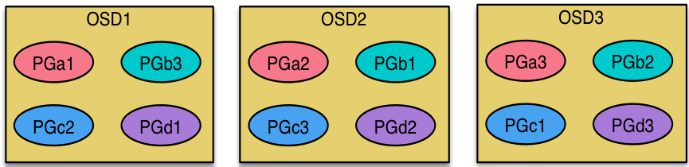

## Storage - Ceph

### 1. Ceph架构简介及使用场景介绍

##### 1.1 Ceph简介
Ceph是一个统一的分布式存储系统，设计初衷是提供较好的性能、可靠性和可扩展性。

Ceph项目最早起源于Sage就读博士期间的工作（最早的成果于2004年发表），并随后贡献给开源社区。在经过了数年的发展之后，目前已得到众多云计算厂商的支持并被广泛应用。RedHat及OpenStack都可与Ceph整合以支持虚拟机镜像的后端存储。

##### 1.2 Ceph特点

- 高性能
	- 摒弃了传统的集中式存储元数据寻址的方案，采用CRUSH算法，数据分布均衡，并行度高。
	- 考虑了容灾域的隔离，能够实现各类负载的副本放置规则，例如跨机房、机架感知等。
	- 能够支持上千个存储节点的规模，支持TB到PB级的数据。
- 高可用性
	- 副本数可以灵活控制。
	- 支持故障域分隔，数据强一致性。
	- 多种故障场景自动进行修复自愈。
	- 没有单点故障，自动管理。
- 高可扩展性
	- 去中心化。
	- 扩展灵活。
	- 随着节点增加而线性增长。
- 特性丰富
	- 支持三种存储接口：块存储、文件存储、对象存储。
	- 支持自定义接口，支持多种语言驱动。

##### 1.3 Ceph架构

支持三种接口：

- Object：有原生的API，而且也兼容Swift和S3的API。
- Block：支持精简配置、快照、克隆。
- File：Posix接口，支持快照。

##### 1.4 Ceph核心组件及概念介绍

- Monitor，一个Ceph集群需要多个Monitor组成的小集群，它们通过Paxos同步数据，用来保存OSD的元数据。
- OSD， OSD全称Object Storage Device，也就是负责响应客户端请求返回具体数据的进程。一个Ceph集群一般都有很多个OSD。
- MDS，MDS全称Ceph Metadata Server，是CephFS服务依赖的元数据服务。
- Object，Ceph最底层的存储单元是Object对象，每个Object包含元数据和原始数据。
- PG，PG全称Placement Grouops，是一个逻辑的概念，一个PG包含多个OSD。引入PG这一层其实是为了更好的分配数据和定位数据。
- RADOS，RADOS全称Reliable Autonomic Distributed Object Store，是Ceph集群的精华，用户实现数据分配、Failover等集群操作。
- Libradio，Librados是Rados提供库，因为RADOS是协议很难直接访问，因此上层的RBD、RGW和CephFS都是通过librados访问的，目前提供PHP、Ruby、Java、Python、C和C++支持。
- CRUSH，CRUSH是Ceph使用的数据分布算法，类似一致性哈希，让数据分配到预期的地方。
- RBD，RBD全称RADOS block device，是Ceph对外提供的块设备服务。
- RGW，RGW全称RADOS gateway，是Ceph对外提供的对象存储服务，接口与S3和Swift兼容。
- CephFS，CephFS全称Ceph File System，是Ceph对外提供的文件系统服务。

##### 1.5 三种存储类型-块存储

典型设备： 磁盘阵列，硬盘

主要是将裸磁盘空间映射给主机使用的。

优点：

- 通过Raid与LVM等手段，对数据提供了保护。
- 多块廉价的硬盘组合起来，提高容量。
- 多块磁盘组合出来的逻辑盘，提升读写效率。

缺点：

- 采用SAN架构组网时，光纤交换机，造价成本高。
- 主机之间无法共享数据。

使用场景：

- docker容器、虚拟机磁盘存储分配。
- 日志存储。
- 文件存储。
- …

##### 1.6 三种存储类型-文件存储

典型设备： FTP、NFS服务器。为了克服块存储文件无法共享的问题，所以有了文件存储。
在服务器上架设FTP与NFS服务，就是文件存储。

优点：

- 造价低，随便一台机器就可以了。
- 方便文件共享。

缺点：

- 读写速率低。
- 传输速率慢。

使用场景：

- 日志存储。
- 有目录结构的文件存储。
- …

##### 1.7 三种存储类型-对象存储

典型设备： 内置大容量硬盘的分布式服务器(swift, s3)

多台服务器内置大容量硬盘，安装上对象存储管理软件，对外提供读写访问功能。

优点：

- 具备块存储的读写高速。
- 具备文件存储的共享等特性。

使用场景： (适合更新变动较少的数据)

- 图片存储。
- 视频存储。
- …
	
###2. Ceph IO流程及数据分布

##### 2.1 正常IO流程图

步骤：

1. client 创建cluster handler。
2. client 读取配置文件。
3. client 连接上monitor，获取集群map信息。
4. client 读写io 根据crshmap 算法请求对应的主osd数据节点。
5. 主osd数据节点同时写入另外两个副本节点数据。
6. 等待主节点以及另外两个副本节点写完数据状态。
7. 主节点及副本节点写入状态都成功后，返回给client，io写入完成。

##### 2.2 新主IO流程图

说明：
如果新加入的OSD1取代了原有的 OSD4成为 Primary OSD, 由于 OSD1 上未创建 PG , 不存在数据，那么 PG 上的 I/O 无法进行，怎样工作的呢？

步骤：

1. client连接monitor获取集群map信息。
2. 同时新主osd1由于没有pg数据会主动上报monitor告知让osd2临时接替为主。
3. 临时主osd2会把数据全量同步给新主osd1。
4. client IO读写直接连接临时主osd2进行读写。
5. osd2收到读写io，同时写入另外两副本节点。
6. 等待osd2以及另外两副本写入成功。
7. osd2三份数据都写入成功返回给client, 此时client io读写完毕。
8. 如果osd1数据同步完毕，临时主osd2会交出主角色。
9. osd1成为主节点，osd2变成副本。

##### 2.3 Ceph IO算法流程

- File用户需要读写的文件。File->Object映射：
	1. ino (File的元数据，File的唯一id)。
	2. ono(File切分产生的某个object的序号，默认以4M切分一个块大小)。
	3. oid(object id: ino + ono)。
- Object是RADOS需要的对象。Ceph指定一个静态hash函数计算oid的值，将oid映射成一个近似均匀分布的伪随机值，然后和mask按位相与，得到pgid。Object->PG映射：
	1. hash(oid) & mask-> pgid 。
	2. mask = PG总数m(m为2的整数幂)-1 。
- PG(Placement Group),用途是对object的存储进行组织和位置映射, (类似于redis cluster里面的slot的概念) 一个PG里面会有很多object。采用CRUSH算法，将pgid代入其中，然后得到一组OSD。PG->OSD映射：
	1. CRUSH(pgid)->(osd1,osd2,osd3) 。

##### 2.4 Ceph RBD IO流程

步骤：

1. 客户端创建一个pool，需要为这个pool指定pg的数量。
- 创建pool/image rbd设备进行挂载。
- 用户写入的数据进行切块，每个块的大小默认为4M，并且每个块都有一个名字，名字就是object+序号。
- 将每个object通过pg进行副本位置的分配。
- pg根据cursh算法会寻找3个osd，把这个object分别保存在这三个osd上。
- osd上实际是把底层的disk进行了格式化操作，一般部署工具会将它格式化为xfs文件系统。
- object的存储就变成了存储一个文rbd0.object1.file。

##### 2.5 Ceph RBD IO框架图

客户端写数据osd过程：

1. 采用的是librbd的形式，使用librbd创建一个块设备，向这个块设备中写入数据。
- 在客户端本地同过调用librados接口，然后经过pool，rbd，object、pg进行层层映射,在PG这一层中，可以知道数据保存在哪3个OSD上，这3个OSD分为主从的关系。
- 客户端与primay OSD建立SOCKET 通信，将要写入的数据传给primary OSD，由primary OSD再将数据发送给其他replica OSD数据节点。

##### 2.6 Ceph Pool和PG分布情况

说明：

- pool是ceph存储数据时的逻辑分区，它起到namespace的作用。
- 每个pool包含一定数量(可配置)的PG。
- PG里的对象被映射到不同的Object上。
- pool是分布到整个集群的。
- pool可以做故障隔离域，根据不同的用户场景不一进行隔离。

##### 2.7 Ceph 数据扩容PG分布

场景数据迁移流程：

- 现状3个OSD, 4个PG
- 扩容到4个OSD, 4个PG

现状：

扩容后：

说明:
每个OSD上分布很多PG, 并且每个PG会自动散落在不同的OSD上。如果扩容那么相应的PG会进行迁移到新的OSD上，保证PG数量的均衡。

### 3. Ceph心跳机制

##### 3.1 心跳介绍

心跳是用于节点间检测对方是否故障的，以便及时发现故障节点进入相应的故障处理流程。

问题：

- 故障检测时间和心跳报文带来的负载之间做权衡。
- 心跳频率太高则过多的心跳报文会影响系统性能。
- 心跳频率过低则会延长发现故障节点的时间，从而影响系统的可用性。

故障检测策略应该能够做到：

- 及时：节点发生异常如宕机或网络中断时，集群可以在可接受的时间范围内感知。
- 适当的压力：包括对节点的压力，和对网络的压力。
- 容忍网络抖动：网络偶尔延迟。
- 扩散机制：节点存活状态改变导致的元信息变化需要通过某种机制扩散到整个集群。

##### 3.2 Ceph 心跳检测

OSD节点会监听public、cluster、front和back四个端口

- public端口：监听来自Monitor和Client的连接。
- cluster端口：监听来自OSD Peer的连接。
- front端口：供客户端连接集群使用的网卡, 这里临时给集群内部之间进行心跳。
- back端口：供客集群内部使用的网卡。集群内部之间进行心跳。
- hbclient：发送ping心跳的messenger。

##### 3.3 Ceph OSD之间相互心跳检测

步骤：

- 同一个PG内OSD互相心跳，他们互相发送PING/PONG信息。
- 每隔6s检测一次(实际会在这个基础上加一个随机时间来避免峰值)。
- 20s没有检测到心跳回复，加入failure队列。

##### 3.4 Ceph OSD与Mon心跳检测

OSD报告给Monitor：

- OSD有事件发生时（比如故障、PG变更）。
- 自身启动5秒内。
- OSD周期性的上报给Monito
	- OSD检查failure_queue中的伙伴OSD失败信息。
	- 向Monitor发送失效报告，并将失败信息加入failure_pending队列，然后将其从failure_queue移除。
	- 收到来自failure_queue或者failure_pending中的OSD的心跳时，将其从两个队列中移除，并告知Monitor取消之前的失效报告。
	- 当发生与Monitor网络重连时，会将failure_pending中的错误报告加回到failure_queue中，并再次发送给Monitor。
- Monitor统计下线OSD
	- Monitor收集来自OSD的伙伴失效报告。
	- 当错误报告指向的OSD失效超过一定阈值，且有足够多的OSD报告其失效时，将该OSD下线。

##### 3.5 Ceph心跳检测总结

Ceph通过伙伴OSD汇报失效节点和Monitor统计来自OSD的心跳两种方式判定OSD节点失效。

- 及时：伙伴OSD可以在秒级发现节点失效并汇报Monitor，并在几分钟内由Monitor将失效OSD下线。
- 适当的压力：由于有伙伴OSD汇报机制，Monitor与OSD之间的心跳统计更像是一种保险措施，因此OSD向Monitor发送心跳的间隔可以长达600秒，Monitor的检测阈值也可以长达900秒。Ceph实际上是将故障检测过程中中心节点的压力分散到所有的OSD上，以此提高中心节点Monitor的可靠性，进而提高整个集群的可扩展性。
- 容忍网络抖动：Monitor收到OSD对其伙伴OSD的汇报后，并没有马上将目标OSD下线，而是周期性的等待几个条件：
	- 目标OSD的失效时间大于通过固定量osd_heartbeat_grace和历史网络条件动态确定的阈值。
	- 来自不同主机的汇报达到mon_osd_min_down_reporters。
	- 满足前两个条件前失效汇报没有被源OSD取消。
- 扩散：作为中心节点的Monitor并没有在更新OSDMap后尝试广播通知所有的OSD和Client，而是惰性的等待OSD和Client来获取。以此来减少Monitor压力并简化交互逻辑。