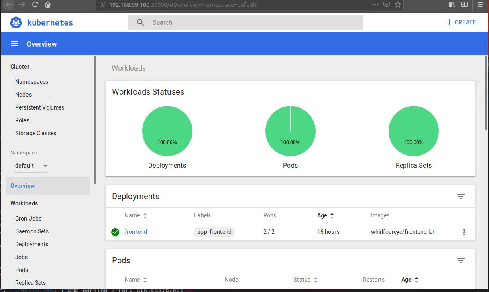

# HW4


## Requirement I

### CI/CD环境搭建

CI/CD环境选择使用Drone+github搭建，在每次push之后，Drone都会对push后的内容进行构建并打包上传

#### 搭建过程

1. 根据官网教程在服务器安装Drone的0.8版本，编写相关配置文件并开启
2. 访问配置文件中设置好的IP即可访问，并登录对应的github账户
3. 开启想要监控的repo，并为止编写.drone.yml文件，.drone.yml文件包括了当监控仓库有了新的push之后需要进行的操作

以下是搭建完成后的访问界面：


上图中打开了对两个仓库的监控

再对一个push进行一次测试：


测试成功

### 准备web应用

此处准备了一个Web应用，并分别在github上建立其前后端的repo，并在drone中开启对它们的监控。
在每次前端或后端的代码push之后，通过编写相应的.drone.yml文件即可将其打包至docker hub上。

前端的.drone.yml配置如下：

``` 
workspace:
  base: /front
  path: src/github.com/XPandora/front-end
pipeline:
  build: 
    image: registry.cn-shenzhen.aliyuncs.com/pipipan/node:1.0
    commands:
      - npm install
      - npm run-script build
  publish:
    image: docker
    secrets: [docker_username,docker_password]
    commands:
        - docker login --username=$DOCKER_USERNAME --password=$DOCKER_PASSWORD         
        - docker build -t xpandora/front-end:master -f Dockerfile .
        - docker push xpandora/front-end:master
    volumes:
        - /var/run/docker.sock:/var/run/docker.sock
    when:
        branch: master
        status: succes
```

后端的.drone.yml配置如下：

```
workspace:
  base: /back
  path: src/github.com/XPandora/back-end
pipeline:
  build: 
    image: registry.cn-hangzhou.aliyuncs.com/acs/maven
    commands:
      - mvn clean package
    volumes:
      - /root/maven/repository:/root/.m2/repository
  publish:
    image: docker
    secrets: [docker_username,docker_password]
    commands:
        - docker login --username=$DOCKER_USERNAME --password=$DOCKER_PASSWORD         
        - docker build -t xpandora/back-end:master -f Dockerfile .
        - docker push xpandora/back-end:master
    volumes:
        - /var/run/docker.sock:/var/run/docker.sock
    when:
        branch: master
        status: success
```

其中workspace制定了pipeline的工作目录，pipeline的build指定了镜像和构建的命令，publish则会发布docker镜像，其中指定了具体的repo和需要的用户名和密码

分别对前后端的工程进行构建并打包上传至docker hub：


## Requirement II

### 搭建Kubernetes环境

本次项目采用minikube来安装Kubernetes的单机调试环境

#### 安装docker

```shell
sudo apt-get update
sudo apt-get install docker.io
```

#### 安装虚拟机

```shell
sudo apt-get install virtualbox
```

#### 安装kubectl

将kubectl作为一个snap应用安装。

```shell
sudo snap install kubectl --classic
```

#### 安装minikube

使用阿里镜像安装minikube

```shell
curl -Lo minikube http://kubernetes.oss-cn-hangzhou.aliyuncs.com/minikube/releases/v0.28.0/minikube-linux-amd64 && chmod +x minikube && sudo mv minikube /usr/local/bin/
```

#### 运行minikube

```shell
minikube start --registry-mirror=https://registry.docker-cn.com
```

#### 查看Kubernetes控制台

```shell
galactus@ubuntu:~/temp$ kubectl version
Client Version: version.Info{Major:"1", Minor:"13", GitVersion:"v1.13.1", GitCommit:"eec55b9ba98609a46fee712359c7b5b365bdd920", GitTreeState:"clean", BuildDate:"2018-12-13T10:39:04Z", GoVersion:"go1.11.2", Compiler:"gc", Platform:"linux/amd64"}
Server Version: version.Info{Major:"1", Minor:"10", GitVersion:"v1.10.0", GitCommit:"fc32d2f3698e36b93322a3465f63a14e9f0eaead", GitTreeState:"clean", BuildDate:"2018-03-26T16:44:10Z", GoVersion:"go1.9.3", Compiler:"gc", Platform:"linux/amd64"}

galactus@ubuntu:~/temp$ kubectl get cs
NAME                 STATUS    MESSAGE              ERROR
scheduler            Healthy   ok                   
controller-manager   Healthy   ok                   
etcd-0               Healthy   {"health": "true"}   

galactus@ubuntu:~/temp$ kubectl get pods --all-namespaces
NAMESPACE     NAME                                    READY   STATUS    RESTARTS   AGE
default       frontend-696f48469c-hcbxj               1/1     Running   0          6m
default       frontend-696f48469c-j6fjt               1/1     Running   0          6m
kube-system   etcd-minikube                           1/1     Running   0          2h
kube-system   kube-addon-manager-minikube             1/1     Running   3          2d
kube-system   kube-apiserver-minikube                 1/1     Running   0          2h
kube-system   kube-controller-manager-minikube        1/1     Running   0          2h
kube-system   kube-dns-b4bd9576-xtpp7                 3/3     Running   9          2d
kube-system   kube-proxy-gv66s                        1/1     Running   0          2h
kube-system   kube-scheduler-minikube                 1/1     Running   2          16h
kube-system   kubernetes-dashboard-685cfbd9f6-tptsf   1/1     Running   6          2d
kube-system   storage-provisioner                     1/1     Running   6          2d

```

也可以通过dashboard查看




## Requirement III

### deployment

```bash
minikube start
kubectl create -f $service_filename.yaml
kubectl apply -f $deploy_filename.yaml --record
minikube service $service_metadata_name
```

LoadBalancer service

```yaml
apiVersion: v1
kind: Service              # 1
metadata:
  name: sa-frontend-lb
spec:
  type: LoadBalancer       # 2
  ports:
  - port: 80               # 3
    protocol: TCP          # 4
    targetPort: 80         # 5
  selector:                # 6
    app: sa-frontend       # 7
```

> \#1 kind：服务；
>
> \#2 type：指定类型，我们选择 LoadBalancer，因为我们想平衡 Pod 之间的负荷；
>
> \#3 ports：指定服务获取请求的端口；
>
> \#4 protocol：定义交流；
>
> \#5 targetPort：可以将来访的请求转发到这个端口；
>
> \#6 selector：包含选择pod属性的对象；
>
> \#7 app：sa-frontend定义了哪个是目标 Pod，只有拥有标签“app: sa-frontend”的才是目标 Pod。

frontend pod

```yaml
apiVersion: extensions/v1beta1
kind: Deployment                                          # 1
metadata:
  name: sa-frontend
spec:
  replicas: 2                                             # 2
  minReadySeconds: 15
  strategy:
    type: RollingUpdate                                   # 3
    rollingUpdate: 
      maxUnavailable: 1                                   # 4
      maxSurge: 1                                         # 5
  template:                                               # 6
    metadata:
      labels:
        app: sa-frontend                                  # 7
    spec:
      containers:
        - image: rinormaloku/sentiment-analysis-frontend
          imagePullPolicy: Always                         # 8
          name: sa-frontend
          ports:
            - containerPort: 80
```

> \#1 kind：部署；
>
> \#2 replicas：是部署 Spec 对象的一个属性，定义了我们想运行多少的 Pod。所以是 2；
>
> \#3 type：指定从当前版本升迁到下个版本的时候，部署使用的策略。此处的策略 RollingUpdate 可以保证部署期间服务不间断；
>
> \#4 maxUnavailable：是 RollingUpdate 对象的一个属性，定义了在升级的时候，最大允许停止的 Pod 数量（与希望的状态相比）。对我们的部署来说，我们有 2 个副本，这意味着在一个 Pod 停止后，我们还会有另外一个 Pod 运行，所以可以保证应用程序可访问；
>
> \#5 maxSurge：是 RollingUpdate 对象的另一个属性，定义了添加到部署的最大 Pod 数量（与希望的状态相比）。对我们的部署来说，这意味着在向新版本迁移的时候，我们可以加一个 Pod，那么我们可以同时拥有个 3 个 Pod；
>
> \#6 template：指定 Pod 的模板，部署在创建新 Pod 的时候，会用到该模板。很可能这个非常相似的 Pod 会立即吸引你；
>
> \#7 app: sa-frontend：根据模板创建的 Pod 将被贴上该标签；
>
> \#8 imagePullPolicy：当设置成 Always 的时候，每一次新部署都会重新获取容器映像。
